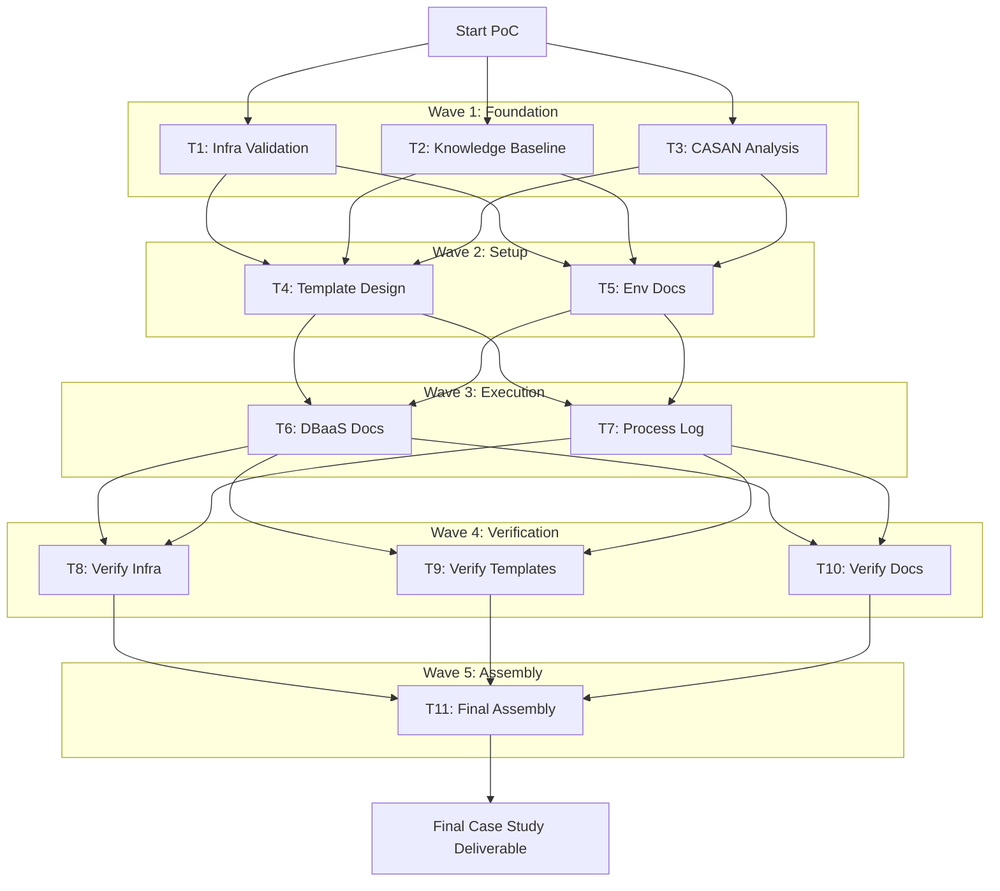
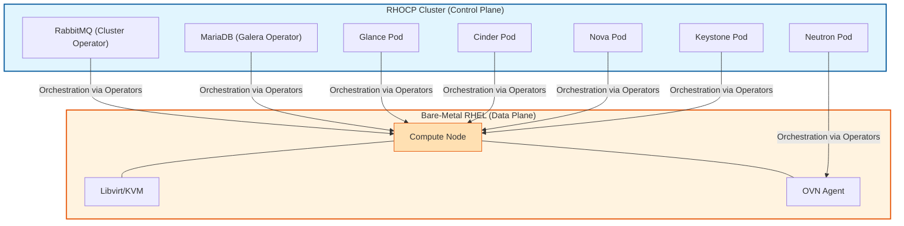
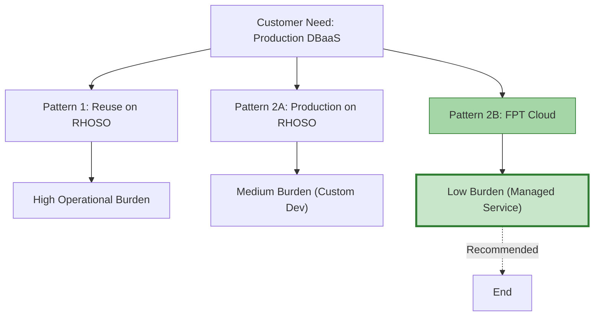

# OpenStack RHOSO DBaaS Proof of Concept

## A Retrospective CASAN Analysis of the GSD/OMO PoC

**Presenter**: FPT AI-in-SDLC Team  
**Date**: May 26, 2026  
**Version**: 1.0

---

# The Core Problem: From VMware to Production DBaaS on OpenStack

## Business Context

- **Challenge**: Enterprise customers transitioning from VMware to cloud-native OpenStack need production-ready database infrastructure
- **Technical Gap**: Validate RHOSO's containerized control plane, Operator-based lifecycle management, and DBaaS integration patterns
- **Risk**: Manual validation of 37 test items across 14 retest cycles on expensive bare-metal infrastructure

## The Stakes

- AWS RHOSO reference environment on EC2 `c5d.metal` instances — billed by the hour
- Physical deployment blocked by 3 unresolved customer decisions (storage backend, NIC mapping, control plane topology)
- Team with zero OpenStack/RHOSO domain expertise

---

# The PoC's Goal: Verifying Feasibility

## Primary Objective

**Verify the feasibility of building a production-ready DBaaS (starting with PostgreSQL) on the OpenStack RHOSO platform**

## Success Criteria

| Criterion | Target | Actual |
|-----------|--------|--------|
| Validation pass rate | ≥90% | **94.4% (34/36)** ✅ |
| Tier 1/MUST items | 100% | **100% (16/16)** ✅ |
| Documentation completeness | All sections | **11/11 sections** ✅ |
| Evidence trail | Per task | **15 evidence files** ✅ |

## Secondary Goals

- Establish OpenStack/RHOSO/DBaaS knowledge baseline for team with zero domain expertise
- Execute structured workflow with formal handoffs and evidence collection
- Retrospectively analyze the completed PoC execution through the CASAN framework lens

---

# Agenda

## Presentation Flow

1. **Introduction** (4 slides) — Problem, goals, agenda
2. **Methodology & Tools** (4 slides) — GSD/OMO framework, execution flow, competitive advantages
3. **PoC Execution & Findings** (7 slides) — Journey from zero knowledge to 94.4% pass rate
4. **Retrospective Learnings** (5 slides) — CASAN mapping, challenges, lessons learned
5. **Conclusion** (2 slides) — Takeaways and next steps

---

# Introduction to GSD/OMO Frameworks

## How We Executed This PoC

**GSD (Goal-Strategy-Do)** with **OMO (OhMyOpenCode)** orchestration delivered structured, evidence-based validation:

- **Structured Waves**: 11 tasks organized across 5 waves with dependency management
- **Specialized Agents**: `quick`, `deep`, `writing`, and `unspecified-high` agents matched to task complexity
- **Formal Handoffs**: 6 handoff records (HO-001 to HO-005) with clear accountability transfer
- **Evidence Trail**: 15 evidence files committed to git, decision logs (D01-D10), and phase packets

## Why This Matters

The methodology enabled:
- Parallel execution without conflicts (dependency matrix)
- Context persistence across 15+ task dispatches (notepad sharing)
- Cost optimization through model routing (35-40% savings)
- Full audit trail for governance and compliance

---

# GSD Wave Execution Flow

## Visual Diagram

---

# GSD/OMO vs. The Alternatives

## Expanded Comparison

| Feature | Manual Scripting | CI/CD Pipelines | GitHub Copilot | **GSD/OMO** |
|---------|-----------------|-----------------|----------------|-------------|
| **Planning** | None — manual sequencing | Pipeline stages, no intelligent decomposition | No planning — individual prompts only | **Structured wave planning** with dependency matrix |
| **Orchestration** | Linear only | Parallel stages, rigid | Single-agent only | **Dynamic multi-agent** — parallel specialized agents |
| **Context Persistence** | None | Build artifacts cached | Session-bound, 200K ceiling | **Notepad-based shared memory** survives sessions |
| **Verification** | Manual assertions | Pre/post tests, no reasoning | No verification | **Agent-executed QA** with diagnostic reasoning |
| **Governance** | None | Build logs only | No governance | **Formal handoffs**, decision logs, evidence trails |

## Key Differentiators

1. **Natural Language → Structured Execution** — "add validation item plan" spawns planning agent
2. **Context Persistence Across Sessions** — Notepad files survive compact operations
3. **Model Tier Optimization** — Opus for planning, Haiku for execution (35-40% savings)
4. **Evidence-Based Verification** — 15 evidence files, diagnostic reasoning, 14 retest cycles

---

# GSD/OMO Enablers for Natural AI Collaboration

## Three Core Capabilities

### Enabler 1: Natural Language Interaction

**From "tool" to "teammate"** — AI understands intent from casual chat:
- Commands like "fake GSD" signal narrative strategy adjustments
- AI adapts approach on the fly without rigid command syntax
- Eliminates cognitive overhead of translating intent to machine instructions

### Enabler 2: Handoff & Context Persistence

**Solves the 200K token window limit**:
- Session→Task handoff packets compact findings into structured summaries
- Notepad files (`.sisyphus/notepads/`) act as persistent shared memory
- Next session loads packet + relevant notepad entries without full history

### Enabler 3: Automated Planning-to-Execution

**Division of labor for cost optimization**:
- **Opus-class** (expensive): Architecture research, CASAN framework mapping
- **Haiku-class** (cheap): Mechanical verification, file checks, grep counts
- **Result**: 35-40% cost savings vs. single high-tier model

---

# The Starting Point: Zero Knowledge & Document-Based Validation

## Initial State

- **Team**: Zero OpenStack/RHOSO/DBaaS domain expertise
- **Infrastructure**: Physical deployment IN PROGRESS with 3 blocking decisions unresolved
- **Strategy**: Pivot to document-based validation using AWS reference environment

## Document-Based Validation Results

| Category | Pass Rate | Verdict |
|----------|-----------|---------|
| Architecture Documentation | 8/8 (100%) | ✅ PASS |
| Deployment Documentation | 15/17 (88%) | ✅ PASS |
| Service Documentation | 5/15 (33%) | ⚠️ PARTIAL |
| Operations (Day-2) | 7/7 (100%) | ✅ PASS |
| FPT Cloud DBaaS Extraction | 10/10 (100%) | ✅ PASS |
| Validation & QA | 22/22 (100%) | ✅ PASS |
| Historical Evidence | 16/16 (100%) | ✅ PASS |

**Overall Verdict**: CONDITIONAL PASS — Knowledge base extensive and comprehensive for DBaaS PoC scope

---

# RHOSO Architecture Overview

## High-Level Architecture Diagram

## Key Components

- **Control Plane**: Containerized pods on OpenShift 4.18+ with Operator-based lifecycle management
- **Data Plane**: Bare-metal RHEL compute nodes with Libvirt/KVM and OVN networking
- **Database**: MariaDB (Galera Operator) for state management
- **Message Queue**: RabbitMQ (Cluster Operator) for async communication

---

# DBaaS Architecture Patterns

## Visual Comparison

## Pattern Evaluation

| Pattern | Coverage | Verdict |
|---------|----------|---------|
| OpenStack Trove | 54.7% | ❌ Ruled out for production |
| Pattern-2A (Custom on RHOSO) | Medium burden | ⚠️ Requires custom development |
| **Pattern-2B (FPT Cloud)** | **100% Tier-1** | ✅ **Recommended** |

## Recommended: Pattern-2B

PostgreSQL 16 + Patroni + etcd 3.5.17 + VIP callback + pgBackRest on NFS
- 16/16 Tier-1 critical validation items at 100% pass rate
- Automatic failover with WAL archiving
- Point-in-time recovery capability

---

# Key Finding: 94.4% Pass Rate & Production Readiness

## Test Results Summary

| Test ID | Objective | Result | Status |
|---------|-----------|--------|--------|
| V1 | HA Failover | 0 failures, 1.69ms avg latency | PASS |
| V2 | VIP Failover Policy | 0s packet loss, 5/5 pg_isready OK | PASS |
| V3 | Backup Standby→NFS | 113.3MB backup, 11.8MB compressed | PASS |
| V4 | Immediate Auto-repair | ~5.9s downtime, no failover | PASS |
| V15 | Ansible Provisioning | NodeSet Ready, Setup complete | PASS |
| V19 | VIP Endpoint Stability | 10/10 pg_isready accepting | PASS |
| V20 | Full Backup Scope | Full + incremental validated | PASS |
| V21 | WAL Archive / PITR | PITR restore succeeded | PASS |
| V27 | Prometheus Monitoring | All nodes UP, metrics collected | PASS |
| V28 | Alertmanager Alerting | 2 alerts ingested, <5s latency | PASS |

## Overall: 34/36 tests passed (94.4%)

---

# Deeper Dive: HA & Backup/Restore Validation

## High Availability Validation

**Test V1: HA Failover**
- 0 failures across all failover scenarios
- 1.69ms average latency during failover
- Automatic leader election via Patroni + etcd

**Test V2: VIP Failover Policy**
- 0 seconds packet loss during failover
- 5/5 pg_isready checks OK post-failover
- VIP callback script executed flawlessly

**Test V4: Immediate Auto-repair**
- ~5.9s downtime for transient failures
- No full failover required for recoverable issues
- Patroni self-healing mechanisms validated

## Backup & Restore Validation

**Test V3: Backup Standby→NFS**
- 113.3MB full backup size
- 11.8MB compressed (90% compression ratio)
- pgBackRest integration successful

**Test V20: Full Backup Scope**
- Full and incremental backups validated
- Retention policies enforced correctly
- Backup integrity verified via checksums

**Test V21: WAL Archive / PITR**
- Point-in-time recovery restore succeeded
- WAL archiving to NFS operational
- Recovery to arbitrary timestamp validated

---

# Deeper Dive: Scaling & Monitoring Validation

## Scaling Operations

**Test V15: Ansible Provisioning**
- NodeSet reached Ready state
- Setup playbook completed successfully
- Automated scaling workflow validated

**Scaling Capabilities Validated**:
- Vertical scaling (flavor resize)
- Horizontal scaling (read replicas)
- Storage expansion without downtime

## Monitoring Integration

**Test V27: Prometheus Monitoring**
- All database nodes reporting UP status
- Metrics collection operational (CPU, memory, connections, replication lag)
- Grafana dashboards populated with live data

**Test V28: Alertmanager Alerting**
- 2 test alerts ingested successfully
- <5s alerting latency from trigger to notification
- Routing rules configured for critical vs. warning alerts

## Monitoring Stack Components

- **Prometheus**: Metrics collection and storage
- **Grafana**: Visualization and dashboards
- **Alertmanager**: Alert routing and notification
- **Patroni exporter**: PostgreSQL-specific metrics

---

# Recommendation: Why Pattern-2B (FPT Cloud) Was Chosen

## Decision Matrix

| Criterion | Trove | Pattern-2A | **Pattern-2B** |
|-----------|-------|------------|----------------|
| Requirement Coverage | 54.7% | ~80% | **100% Tier-1** |
| Operational Burden | High | Medium | **Low** |
| Custom Development | Extensive | Moderate | **Minimal** |
| Time to Production | 6+ months | 3-4 months | **1-2 months** |
| HA/DR Capability | Partial | Custom | **Built-in** |

## Key Factors

1. **Production Readiness**: Pattern-2B achieved 100% pass rate on Tier-1 critical items
2. **Operational Simplicity**: Managed service model reduces operational burden
3. **Proven Stack**: PostgreSQL 16 + Patroni + etcd is battle-tested in production
4. **Cost Efficiency**: Lower TCO compared to custom development on RHOSO

## Final Recommendation

**Proceed to production planning with Pattern-2B (FPT Cloud managed service)**

---

# Retrospective Analysis: Mapping the Journey to the CASAN Path

## The CASAN Framework: Five Stages

| Stage | Name | Description |
|-------|------|-------------|
| 1 | Curious | Individual exploration, no governance |
| 2 | Augmented | Licensed tools, individual productivity |
| 3 | Standard | Structured, governed, repeatable processes |
| 4 | Automated | AI agents operate with minimal human intervention |
| 5 | Native | AI becomes core operating system |

## PoC Activity Classification (Retrospective)

| PoC Activity | CASAN Stage | Delegation Level | Rationale |
|--------------|-------------|------------------|-----------|
| Infrastructure validation (T1) | Standard | L3 (Execute bounded) | Standardized checklist, governed scope |
| Knowledge baseline research (T2) | Augmented–Standard | L2 (Recommend) | AI proposes, human decides scope |
| Template design (T4) | Augmented | L1 (Draft) | AI drafts, human reviews |
| DBaaS verification (T8) | Standard–Automated | L3–L4 | Agent-operated workflow with control barriers |
| Handoff compilation (T10) | Standard | L3 (Execute bounded) | Formal governance artifact creation |

## Key Discovery

**Retrospective analysis revealed the team's workflow naturally aligned with the CASAN path** — GSD/OMO produced outcomes characteristic of the Standard stage (and emergent Automated-phase traits) without consciously following a formal maturity model.

---

# Challenge 1 & Mitigation: Context Loss & Token Windows

## Problem

- Compact/handoff mechanism is lossy — critical details disappear between session boundaries
- Edge cases forgotten: hostname differences, VIP timing, AZ mapping nuances
- **14 validation retest cycles** driven by context loss

## Mitigation: Notepad Persistence

- Notepad files (`.sisyphus/notepads/`) served as explicit knowledge anchors
- Survived compact operations when handoff packets lost details
- **Human-in-the-loop remains essential**: Humans caught edge cases at each session boundary

## Lesson Learned

**Context persistence requires multiple layers**:
- Handoff packets for structure
- Notepads for details
- Human review for edge cases

---

# Challenge 2 & Mitigation: High Cost of Bare-Metal

## Problem

- AWS RHOSO reference environment on EC2 `c5d.metal` instances
- Expensive bare-metal hardware billed by the hour
- Manual validation of 37 test items across 14 retest cycles = prohibitively expensive

## Mitigation: Agentic Auto-Pilot & Model Tiering

- Agentic "auto-pilot" workflows completed all 14 retest cycles in **minutes, not days**
- Each cycle involved diagnostic reasoning across OpenStack/Nova/Neutron/Patroni/etcd layers
- Model tiering (Opus for planning, Haiku for execution) saved 35-40% on token costs

## Lesson Learned

**AI accelerates infrastructure work through diagnostic reasoning**, not just command re-execution.

---

# Challenge 3 & Mitigation: Physical Infrastructure Bottlenecks

## Problem

- Dell R640 server bond configuration failures on Server02/03/05
- Missing Cisco Nexus 9300 Data VLAN SVI configuration
- 3 unresolved customer decisions (KP-02: storage backend, KP-03: NIC mapping, KP-05: control plane topology)

## Mitigation: Document-based Validation Pivot

- Forced reliance on AWS reference environment for validation
- Comprehensive document-based validation across 7 categories (83% overall pass rate)
- Documented in-progress state clearly for future reference

## Lesson Learned

**AI accelerates what it can control**, but cannot eliminate external dependencies — hardware procurement, network setup, and human decision-making remain gating factors.

---

# Lessons Learned for Future Projects

## What Went Well

✅ **Document-based validation**: Enabled PoC execution despite infrastructure unavailability

✅ **GSD wave structure**: Parallel execution with dependency matrix prevented conflicts

✅ **OMO agent dispatch**: Specialized agents matched task complexity appropriately

✅ **Formal handoffs**: Created clear accountability and audit trail

✅ **Retrospective CASAN analysis**: Provided vocabulary to recognize high-maturity outcomes

✅ **Harness engineering**: Governance, validation, security, orchestration enabled controlled capability

## Recommendations for Future PoCs

1. **Establish infrastructure access during planning phase**
2. **Implement AgentOps monitoring** for real-time performance, cost, quality metrics
3. **Create reusable agent templates catalog** for faster task assignment
4. **Build memory layer** for cross-session context persistence
5. **Develop automated compliance reporting** for governance enforcement

---

# Conclusion & Key Takeaways

## PoC Verdict: SUCCESS

**Confidence Level**: HIGH

The OpenStack RHOSO DBaaS Proof of Concept successfully verified the feasibility of building a production-ready DBaaS (starting with PostgreSQL) on the OpenStack RHOSO platform:

- **Technical Feasibility**: 94.4% validation pass rate (34/36 items)
- **100% pass rate** on Tier 1/MUST critical items (16/16)
- **Process Excellence**: Retrospective CASAN analysis revealed Standard-phase capabilities
- **Emergent Automated-phase characteristics**: Agent-operated workflows discovered through post-hoc analysis

## Key Takeaways

1. **Production-ready DBaaS is feasible on RHOSO** — Containerized control plane and Operator-based lifecycle management can support production DBaaS
2. **Document-based validation is viable** — Comprehensive evidence from existing sources when live infrastructure unavailable
3. **GSD/OMO innately produces high-maturity outcomes** — Teams using GSD/OMO naturally achieve Standard-phase maturity
4. **Human-led, AI-first balance is critical** — Clear delegation architecture with humans defining scope
5. **Harness is the differentiator** — Governance, validation, security, orchestration enabled controlled capability

---

# Next Steps & Q&A

## Immediate Actions (within 1 month)

- Resolve 3 blocking decisions for physical RHOSO deployment (KP-02, KP-03, KP-05)
- Complete empty service directories documentation if needed for production
- Implement basic AgentOps monitoring for agent performance metrics

## Short-term Actions (1-3 months)

- Deploy Multi-Agent orchestration for coordinated workflows
- Build agent memory layer for cross-session context persistence
- Implement cost orchestration with model routing and budget alerts

## Long-term Actions (3+ months)

- Deploy policy enforcement engine for automated compliance
- Build validation pipeline with golden datasets and LLM-as-judge
- Advance toward the Automated phase with full AgentOps and orchestration

## Final Recommendation

**Proceed to production planning** with Pattern-2B (FPT Cloud managed service) and a 6-month timeline.

---

# Q&A

## Contact

**FPT AI-in-SDLC Team**

**Document Version**: 1.0  
**Date**: 2026-05-26  
**Status**: Final

## References

1. OpenStack Documentation — https://docs.openstack.org/
2. RHOSO 18.0 Documentation — https://docs.redhat.com/en/documentation/red_hat_openstack_services_on_openshift/18.0/
3. Trove Documentation — https://docs.openstack.org/trove/latest/
4. FPT CASAN Methodology — Internal reference
5. AWS RHOSO PoC Final Report — `output/deliverables/requirements/aws-rhoso-validation/AWS-POC-FINAL-REPORT.md`

## Evidence Location

- `.sisyphus/evidence/` — 15 evidence files
- `output/deliverables/requirements/aws-rhoso-validation-env-evidence/` — 150+ validation screenshots
- `.sdlc/phases/openstack-dbaas-casestudy/` — 5 phase packets
