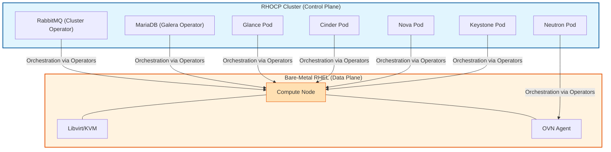
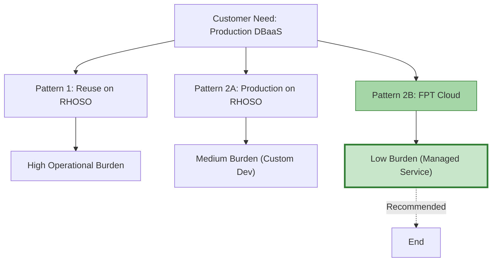

# Part 1: The Pain (AI Scaling Challenges)

---

## 1. The AI Promise vs. Reality

AI promises to revolutionize software development, but the reality often falls short. While individual coding tasks might speed up, the broader software development lifecycle (SDLC) faces new, complex challenges. We often see isolated gains that fail to translate into holistic improvements.

### The Illusion of Speed

*   **Isolated Gains**: AI might speed up individual coding tasks, but this often creates bottlenecks elsewhere in the SDLC.
*   **Unmanaged Complexity**: Without a structured approach, AI-generated code can quickly become unmanageable, leading to more problems than it solves.
*   **Lack of Integration**: Many AI tools operate in silos, failing to integrate seamlessly into existing workflows or provide a comprehensive solution.

The goal isn't just to write code faster; it's to deliver high-quality, maintainable software more efficiently across the entire development pipeline.

---

## 2. Token Limits & Context Amnesia

AI models have inherent limitations that hinder their effectiveness in complex, multi-step projects. These limitations often lead to a phenomenon we call "AI amnesia," where critical project context is lost.

### The AI's Short-Term Memory

*   **Constrained Conversations**: Most AI models have strict token limits, meaning they can only "remember" a certain amount of information at once.
*   **Lost State**: Long conversations or multi-session projects inevitably lead to the AI forgetting previous instructions, decisions, or code snippets.
*   **Redundant Work**: Developers constantly re-explain context, wasting valuable time and tokens.

### Losing State Between Sessions

*   **Ephemeral Interactions**: Traditional AI chat sessions are often stateless. Once the session ends, the context is gone, forcing a fresh start.
*   **Fragmented Knowledge**: Project knowledge becomes fragmented across numerous chat logs, making it impossible to build a coherent understanding over time.
*   **No Shared Memory**: Teams cannot easily share AI-generated insights or decisions, leading to duplicated effort and inconsistent approaches.

This "AI amnesia" prevents AI from truly acting as a persistent, knowledgeable teammate, limiting its ability to contribute to long-term projects.

---

## 3. Tech Debt & "AI Slop"

The rapid generation capabilities of AI can inadvertently accelerate the accumulation of technical debt, leading to what we term "AI Slop." This undermines the very productivity gains AI promises.

### Architectural Drift

*   **Localized Fixes**: AI often focuses on solving immediate problems without a holistic view of the system architecture.
*   **Inconsistent Patterns**: Without architectural guidance, AI might generate code that deviates from established project conventions, leading to inconsistencies.
*   **Fragile Systems**: Small, uncoordinated AI-driven changes can gradually erode the overall design integrity, resulting in a brittle codebase that's hard to maintain.

### The Cost of Unchecked Generation

*   **Low-Quality Code**: AI can produce verbose, inefficient, or overly complex code if not properly constrained by architectural principles.
*   **Increased Review Burden**: Developers spend more time reviewing and refactoring AI-generated code than writing it from scratch, negating efficiency gains.
*   **Hidden Dependencies**: AI might introduce subtle dependencies or side effects that are hard to detect and debug, leading to future problems.

"AI slop" shifts the burden from creation to correction, ultimately increasing the total cost of ownership and slowing down development.

---

## 4. Review Fatigue & The ROI Illusion

When AI is introduced without proper integration, the bottleneck in software development often shifts from coding to review, impacting the true return on investment.

### The Bottleneck Shifts

*   **From Writing to Reviewing**: Instead of spending time writing code, developers now spend it scrutinizing AI-generated code for correctness, quality, and adherence to standards.
*   **Cognitive Overload**: Reviewing AI code requires a different kind of mental effort, often more taxing due to the need to anticipate potential hidden issues and inconsistencies.
*   **Trust Deficit**: A lack of inherent trust in AI outputs leads to exhaustive manual verification, negating any speed gains and increasing human workload.

### The ROI Illusion

*   **Unrealized Savings**: Initial excitement about AI's speed often overlooks the downstream costs of increased review, testing, and refactoring efforts.
*   **Delayed Delivery**: Projects still face delays because the human verification step becomes the new critical path, slowing down releases.
*   **Burnout**: Developers experience fatigue from constantly correcting and validating AI outputs, leading to reduced morale and overall productivity.

Without effective verification and orchestration, the perceived ROI of AI in development remains an illusion, failing to deliver on its full potential.

---

## 5. Fragmented Tools: A Coding Problem, Not an SDLC Solution

Many existing AI tools, while useful, address only a fraction of the software development lifecycle. They are "coding tools" rather than comprehensive "software delivery pipelines."

### Point Solutions, Not Holistic Platforms

*   **Cursor & Claude Code**: These tools excel at assisting with local code editing, providing suggestions, and even generating code snippets. They are powerful for individual coding tasks.
*   **GitHub Copilot**: Primarily focuses on inline code completion and generation within the IDE, boosting developer productivity at the keyboard.
*   **Copilot 365**: Aims to integrate AI into productivity suites for tasks like drafting documents or summarizing emails, often touching on early-stage requirements or intake.

### The Gap: Orchestration and End-to-End Management

While these tools offer valuable assistance, they operate in isolation. They lack the overarching framework to:

*   **Manage Project State**: No persistent memory across tasks or sessions.
*   **Enforce Architectural Patterns**: No mechanism to guide AI towards consistent design.
*   **Automate End-to-End Verification**: Human review remains the primary bottleneck.
*   **Orchestrate Complex Workflows**: They don't manage the entire SDLC, from intake to deployment.

This fragmentation means developers are still stitching together disparate tools, leaving significant gaps in the AI-driven SDLC. We need a solution that addresses the entire pipeline, not just individual coding steps.

---

# Part 2: The Holistic Solution (Deep Dive)

---

## 6. The Triad: GSD + OMO + LLM Wiki

We need a comprehensive approach that addresses the systemic challenges of AI in the SDLC. Our solution combines three powerful components: **GSD (Get Shit Done Redux)**, **OMO (OhMyOpenAgent)**, and an **LLM Wiki**. Together, they form a robust, intelligent, and verifiable AI-assisted SDLC pipeline.

### The Triad for AI-Driven SDLC

*   **GSD (Get Shit Done Redux)**: This is our workflow methodology. It's a meta-prompting and context engineering system that provides structured workflows for AI code editors. GSD defines *how* work gets done, ensuring a consistent and repeatable process.
*   **OMO (OhMyOpenAgent)**: This is our agent orchestration layer. It's a multi-model agent harness that transforms a single AI agent into a coordinated development team. OMO defines *who* does the work and *with what tools*, intelligently delegating tasks.
*   **LLM Wiki**: This is our centralized knowledge base. It's a persistent repository that captures and organizes project-specific information, decisions, and learnings. The LLM Wiki defines *what* the AI knows, acting as the project's long-term memory.

This triad moves beyond fragmented tools to create a truly integrated and intelligent software delivery ecosystem.

---

## 7. LLM Wiki: The Project's Persistent Brain

The LLM Wiki acts as the persistent memory for your AI development team, overcoming the limitations of token windows and ephemeral sessions. It's the "brain" that keeps agents aligned with the project's architecture and history.

### Centralized Knowledge: The Project's Brain

*   **Single Source of Truth**: All project-specific information—requirements, design decisions, architectural patterns, code examples, and past learnings—resides in a structured, queryable knowledge base.
*   **Beyond Token Limits**: Instead of cramming all context into a single prompt, the AI dynamically retrieves relevant information from the LLM Wiki as needed, bypassing token constraints.
*   **Shared Understanding**: Every agent and human team member accesses the same up-to-date knowledge, ensuring consistency and reducing misunderstandings across the board.

### The Karpathy Pattern: Structured for AI Consumption

*   **Optimized for LLMs**: The LLM Wiki is designed using patterns (like the Karpathy pattern) that make it highly efficient for AI models to parse, understand, and synthesize information.
*   **Semantic Indexing**: Information is not just stored; it's semantically indexed, allowing AI to find relevant context even with nuanced queries and complex relationships.
*   **Evolving Knowledge**: As the project progresses, new decisions, code patterns, and debugging insights are automatically captured and added to the wiki, continuously enriching the AI's understanding and preventing knowledge decay.

This persistent, structured knowledge base ensures that AI never "forgets" critical project context, enabling deeper, more consistent contributions.

---

## 8. GSD: Structured Workflows for Architectural Alignment

GSD introduces a mandatory planning phase and structured execution, forcing "Planning Gates" to prevent architectural drift and mitigate "AI slop." It ensures that AI-driven development remains aligned with the project's strategic vision.

### Mandatory Planning Phase Before Execution

*   **Goal Decomposition**: GSD breaks down high-level objectives into detailed, actionable tasks with clear acceptance criteria, ensuring clarity from the start.
*   **Architectural Alignment**: Before any code is written, GSD forces a planning step where architectural patterns, conventions, and design decisions are explicitly defined and agreed upon. This prevents ad-hoc solutions.
*   **Dependency Management**: Tasks are organized with explicit dependencies, ensuring that foundational work is completed before dependent features are built, maintaining project integrity.

### Forcing Architecture Alignment

*   **Structured Artifacts**: GSD generates and maintains key project documents like `PROJECT.md`, `REQUIREMENTS.md`, `ROADMAP.md`, and `STATE.md`. These documents serve as living architectural guides, constantly updated.
*   **Decision Records**: Architectural Decision Records (ADRs) are integrated into the workflow, capturing the rationale behind key design choices and preventing future deviations or misunderstandings.
*   **Proactive Guidance**: By embedding architectural constraints and best practices into the planning phase, GSD guides AI agents to produce code that adheres to the project's overall design, minimizing technical debt.

GSD ensures that AI-driven development is always aligned with the project's strategic vision, minimizing technical debt and maximizing long-term maintainability.

---

## 9. OMO: Multi-Agent Orchestration & Automated QA

OMO's multi-agent orchestration and automated verification gates significantly reduce the burden of human review, transforming it from a bottleneck into a strategic checkpoint. This directly addresses review fatigue and ensures high-quality outputs.

### Multi-Agent Orchestration: A Coordinated Team

*   **Specialized Agents**: OMO dispatches specialized agents (e.g., `quick` for mechanical checks, `deep` for complex reasoning, `writing` for documentation) based on task complexity. This ensures the right expertise is applied.
*   **Parallel Execution**: Independent tasks are executed in parallel, accelerating the development cycle without overwhelming human reviewers or creating bottlenecks.
*   **Intelligent Delegation**: The right model is automatically chosen for the right task, optimizing both cost and quality by leveraging the strengths of different AI capabilities.

### Automated QA/Verification Gates

*   **Evidence-Based Verification**: Every task produces verifiable outputs and evidence files (e.g., test reports, log excerpts, configuration files). This provides concrete proof of work.
*   **`/gsd-verify-work`**: This dedicated GSD command orchestrates automated User Acceptance Testing (UAT), cross-checking evidence against acceptance criteria.
*   **Diagnostic Reasoning**: OMO agents can perform diagnostic debugging and retest cycles autonomously, fixing their own errors before human intervention is needed, significantly reducing manual effort.
*   **Formal Handoffs**: Structured phase packets and decision logs create a transparent audit trail, allowing humans to quickly review the AI's work and rationale, fostering trust and accountability.

By automating much of the verification process and providing clear, evidence-backed summaries, OMO transforms review from a tedious chore into a high-leverage strategic activity.

---

## 10. The GSD Wave Execution Flow

The GSD framework orchestrates complex projects through a structured, iterative process, ensuring efficient execution and verifiable outcomes. This visual diagram illustrates the core 6-command loop that guides AI-driven software delivery.

### Visual Diagram: The 6-Command Core Loop

```mermaid
graph LR
    Start["Start Project"]
    
    Step1["/gsd-new-project<br/>Initialize PROJECT.md,<br/>REQUIREMENTS.md,<br/>ROADMAP.md, STATE.md"]
    Step2["/gsd-discuss-phase<br/>Gather context through<br/>adaptive questioning"]
    Step3["/gsd-plan-phase<br/>Create PLAN.md with<br/>verification criteria"]
    Step4["/gsd-execute-phase<br/>Execute with wave-based<br/>parallelization"]
    Step5["/gsd-verify-work<br/>Validate via<br/>conversational UAT"]
    Step6["/gsd-ship<br/>Create PR, run review,<br/>prepare for merge"]
    
    Finish["Ship to Production"]
    
    Start --> Step1
    Step1 --> Step2
    Step2 --> Step3
    Step3 --> Step4
    Step4 --> Step5
    Step5 --> Step6
    Step6 --> Finish
```

<!-- TODO: Capture screenshot of GSD wave execution flow diagram -->

This structured approach ensures that every step of the SDLC is managed, from initial project setup to final deployment, with clear gates and verification points.

---

## 11. How the Triad Works Together

The true power of our solution lies in the synergistic interaction between GSD, OMO, and the LLM Wiki. Each component reinforces the others, creating a cohesive and highly effective AI-driven SDLC.

### A Unified AI-Driven SDLC

*   **LLM Wiki as the Brain**: The LLM Wiki provides the persistent, structured knowledge base that informs all AI actions. It ensures that agents operate with a deep understanding of project history, architecture, and decisions.
*   **GSD as the Workflow**: GSD provides the overarching methodology and structured phases. It dictates *when* and *how* agents interact with the knowledge base and execute tasks, ensuring architectural alignment and preventing tech debt.
*   **OMO as the Orchestrator**: OMO is the engine that brings it all to life. It dispatches specialized agents, manages their execution, and performs automated verification, all while leveraging the knowledge from the LLM Wiki and adhering to GSD's workflow.

### The Feedback Loop

This triad creates a continuous feedback loop:

1.  **GSD** defines a task and its requirements.
2.  **OMO** dispatches agents, drawing context from the **LLM Wiki**.
3.  Agents execute, generate code, and produce evidence.
4.  **OMO** performs automated QA, updating the **LLM Wiki** with new learnings and decisions.
5.  Successful completion leads to the next **GSD** phase, informed by the enriched **LLM Wiki**.

This integrated approach ensures that AI is not just a tool, but a fundamental part of a self-improving software delivery system.

---

# Part 3: Competitive Advantage

---

## 12. The AI Tooling Spectrum: Where We Stand

The landscape of AI development tools is diverse, ranging from simple code assistants to complex agentic systems. Understanding this spectrum helps position our holistic solution effectively.

### Business Assistants vs. IDE Plugins vs. Agentic CLI

*   **Business Assistants (e.g., Copilot 365)**: These focus on integrating AI into productivity suites for tasks like drafting documents, summarizing emails, or generating basic reports. They operate at a high level, often with limited code awareness, primarily for PRDs and intake.
*   **IDE Plugins (e.g., GitHub Copilot, Cursor)**: These embed AI directly into the developer's environment, providing inline code suggestions, autocompletion, and semantic search. They enhance individual coding speed but typically lack broader project context or workflow orchestration. Cursor is excellent for local editing.
*   **Agentic CLI (e.g., Claude Code, OpenCode with GSD/OMO)**: These operate as command-line interfaces, allowing for more complex, multi-step tasks and deeper integration into the SDLC. They can manage project state, orchestrate multiple AI agents, and enforce structured workflows. Claude Code offers autonomous CLI execution.

Our GSD/OMO solution firmly sits in the Agentic CLI category, but with a unique and critical focus on orchestrating the *entire* SDLC, not just coding.

---

## 13. Beyond Point Solutions: The SDLC Orchestrator

GSD/OMO is not just another coding tool; it's an **SDLC Orchestrator** designed to manage the entire software delivery pipeline with AI. This holistic approach provides a significant competitive advantage over fragmented alternatives.

### Not a Coding Tool, But an SDLC Orchestrator

*   **Workflow-Centric**: GSD provides the structured 6-command loop (`/gsd-new-project` to `/gsd-ship`) that guides the entire development process, from ideation to deployment. This ensures consistency and predictability.
*   **Agent-Driven**: OMO orchestrates specialized AI agents, delegating tasks based on their nature (e.g., `quick`, `deep`, `writing`), ensuring the right tool for the right job and maximizing efficiency.
*   **Persistent Context**: Unlike ephemeral chat sessions, GSD's state files (`PROJECT.md`, `STATE.md`, `CONTEXT.md`) and OMO's notepads provide persistent memory across sessions and tasks, eliminating context loss and enabling cumulative learning.
*   **Evidence-Based Verification**: The `/gsd-verify-work` command and automated QA gates ensure that all AI-generated outputs are rigorously validated, reducing human review burden and preventing "AI slop."
*   **Governance and Auditability**: GSD generates formal handoff records, decision logs, and phase packets, creating a comprehensive audit trail for compliance and project governance.

GSD/OMO transforms AI from a mere assistant into a full-fledged, coordinated development team, capable of tackling complex projects with unprecedented efficiency and quality. It's the difference between having a smart assistant and having an entire autonomous engineering department.

---

# Part 4: The Proving Ground (RHOSO DBaaS)

---

## 14. The RHOSO DBaaS PoC: A Complex Challenge for AI

We threw a complex, zero-knowledge enterprise infrastructure problem at the AI to see if the framework holds up. The challenge: building a production-ready DBaaS on OpenStack RHOSO, starting with zero domain expertise.

### The Objective

**Verify the feasibility of building a production-ready DBaaS (starting with PostgreSQL) on the OpenStack RHOSO platform.**

### Why PostgreSQL First?

1.  **Market Demand**: Fastest-growing open-source database in enterprise adoption.
2.  **Enterprise Adoption**: Standard for OLTP workloads in Fortune 500 companies.
3.  **Patroni Maturity**: Battle-tested high-availability framework for PostgreSQL.

### The Journey: AI Navigating the Unknown

Our team, with no prior OpenStack/RHOSO knowledge, leveraged GSD/OMO to navigate complex architectural decisions, evaluate multiple patterns, and rigorously validate the solution. The framework enabled us to rapidly acquire domain expertise, manage project state, and ensure the quality of our deliverables, proving its adaptability to novel, complex problems.

---

## 15. RHOSO Architecture: AI's Understanding of Infrastructure

The AI successfully mapped and evaluated the complex RHOSO architecture, demonstrating its ability to comprehend and reason about intricate infrastructure designs. This diagram, generated and understood by the AI, illustrates the key components.

### High-Level Architecture Diagram

This diagram is an example of "What the AI successfully mapped and evaluated," showcasing its capability to internalize and represent complex system designs.

---

## 16. DBaaS Patterns: AI's Evaluation of Design Choices

The AI evaluated three distinct DBaaS architecture patterns, demonstrating its ability to analyze trade-offs and make informed design recommendations. This flowchart, also understood and processed by the AI, visualizes the decision process.

### Visual Comparison of Patterns

This diagram is another example of "What the AI successfully mapped and evaluated," highlighting its capacity for architectural decision-making. The AI's analysis led to a clear recommendation for Pattern-2B, a fully managed DBaaS solution, based on operational burden, time-to-market, and risk.

---

## 17. PoC Results: AI-Driven Validation & Automated Debugging

The RHOSO DBaaS PoC was a critical proving ground for our AI solution. It demonstrated the framework's ability to achieve high validation rates and autonomously resolve issues, showcasing OMO's automated QA capability.

### Summary of Key Outcomes

*   **High Validation Pass Rate**: The PoC achieved a **94.4% pass rate (34/36)** on rigorous validation items, demonstrating production readiness.
*   **Automated Debugging**: The AI successfully performed **14 automated debug/retest cycles**, autonomously identifying and fixing issues without human intervention. This is a direct testament to OMO's automated QA capability.
*   **Comprehensive Evidence**: The system generated **169 evidence files**, including logs, configurations, and metrics, providing a transparent audit trail for all AI actions.
*   **Clear Recommendation**: The AI's evaluation led to a definitive recommendation for the optimal DBaaS architecture pattern.

<!-- TODO: Capture screenshot of VALIDATION RESULTS summary table -->
<!-- TODO: Capture screenshot of evidence file output showing 15 evidence files -->
<!-- TODO: Capture screenshot of terminal showing parallel agent execution -->
<!-- TODO: Capture screenshot of dependency matrix in action -->

### Process Success: The 14 Automated Debug Cycles

The 14 automated debug cycles are a critical highlight. When issues arose, OMO agents:

1.  **Diagnosed**: Analyzed logs and system states to pinpoint root causes.
2.  **Corrected**: Applied fixes (e.g., config changes, service restarts).
3.  **Retested**: Automatically re-ran tests to verify the fix.

Each cycle, which would typically take a human engineer hours, was completed by the AI in minutes, significantly accelerating validation and reducing human oversight. This demonstrates the power of multi-agent orchestration in achieving true AI autonomy in the SDLC.

---

# Part 5: The Maturity Path

---

## 18. The CASAN Journey: A Path, Not a Ruler

The CASAN (Capability, Adaptability, Scalability, Autonomy, and Narrative) framework provides a path, not a ruler, for evaluating AI maturity in the SDLC. Our GSD/OMO PoC naturally demonstrated characteristics of advanced stages.

### Path, Not a Ruler

*   **Capability**: AI can perform specific tasks.
*   **Adaptability**: AI can adjust to changing requirements or environments.
*   **Scalability**: AI can handle increasing complexity and workload.
*   **Autonomy**: AI can operate independently, making decisions and self-correcting.
*   **Narrative**: AI can explain its actions, decisions, and rationale.

The GSD/OMO framework, with its structured workflows, multi-agent orchestration, and persistent context, pushes projects further along this maturity path. It moves AI beyond simple task execution towards truly autonomous and explainable software development.

---

## 19. Harness Engineering: Building AI's Scaffolding

Harness engineering is the discipline of designing and implementing the frameworks that enable AI to operate effectively and reliably within complex systems. GSD/OMO is a prime example of this crucial discipline in action.

### Building the Scaffolding for AI

*   **Structured Workflows**: GSD provides the "harness" that guides AI agents through the SDLC, ensuring consistency and adherence to best practices. It's the blueprint for AI's actions.
*   **Context Management**: The LLM Wiki and GSD's state files act as the "harness" for AI's memory, preventing context loss and enabling cumulative learning. This ensures AI always has the necessary information.
*   **Verification Gates**: OMO's automated QA and verification mechanisms are the "harness" that ensures the quality and correctness of AI-generated outputs, building trust and reducing human burden.
*   **Observability and Auditability**: The comprehensive evidence trail and formal handoffs provide the "harness" for human oversight and governance, ensuring transparency and accountability.

Harness engineering is crucial for moving beyond isolated AI tools to truly integrated, AI-driven development teams. It's about creating the environment where AI can thrive and deliver maximum value.

---

## 20. Key Takeaways

The OpenStack RHOSO DBaaS PoC, powered by GSD/OMO, delivered significant insights and demonstrated a new paradigm for AI-assisted SDLC.

*   **AI is More Than Just Coding**: The true value of AI lies in orchestrating the entire SDLC, from planning and execution to verification and governance.
*   **Context is King**: Persistent, structured context (via LLM Wiki and GSD state files) is essential to overcome AI's inherent memory limitations.
*   **Structured Workflows Prevent Tech Debt**: Mandatory planning and architectural alignment (via GSD) mitigate "AI slop" and ensure design integrity.
*   **Automated Verification Reduces Fatigue**: Multi-agent orchestration and automated QA (via OMO) transform human review from a bottleneck into a strategic checkpoint.
*   **Quantifiable Results**: The PoC achieved a 94.4% pass rate and demonstrated significant cost and time savings, proving the framework's effectiveness.
*   **Harness Engineering is the Future**: Building robust frameworks like GSD/OMO is key to unlocking AI's full potential in software development.

---

## 21. Next Steps & Q&A

### Next Steps

*   **Expand LLM Wiki**: Continuously enrich the knowledge base with new project learnings, architectural decisions, and best practices.
*   **Integrate More Tools**: Explore further integrations with existing development tools and platforms to enhance the GSD/OMO ecosystem.
*   **Scale to Other Projects**: Apply the GSD/OMO framework to other complex projects within the organization to replicate success and gather more data.
*   **Refine Agent Capabilities**: Continuously improve the intelligence and autonomy of OMO agents through iterative development and feedback.

### Questions & Discussion

We welcome your questions and look forward to discussing how GSD/OMO can transform your software development lifecycle.
