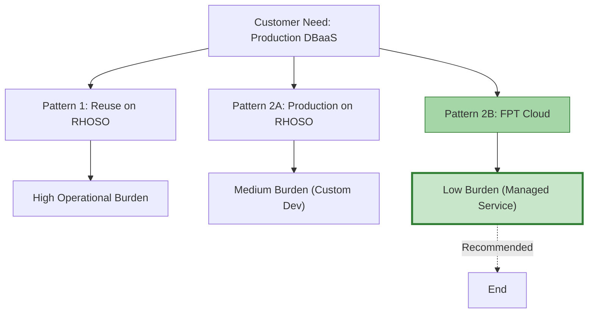
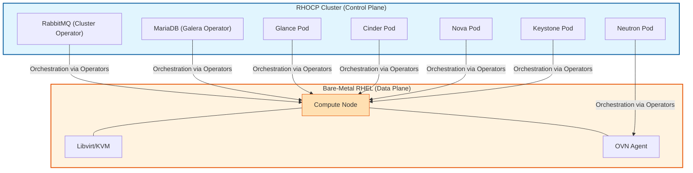

# Part 1: The Context & The Pain

---

## 1. Title Slide

# OpenStack RHOSO DBaaS: AI-Driven SDLC for Production Readiness

## Solving AI Scaling, Tech Debt, and Review Fatigue with GSD/OMO

---

## 2. Project Context: Greenfield OpenStack RHOSO DBaaS

### The Challenge: From VMware to Cloud-Native OpenStack

Enterprise customers are moving from traditional VMware setups to cloud-native OpenStack. This shift demands production-ready database infrastructure. Our task was to validate RHOSO's containerized control plane, Operator-based lifecycle management, and DBaaS integration patterns.

### The Stakes

*   **Costly Infrastructure**: We used an AWS RHOSO reference environment on EC2 `c5d.metal` instances, billed hourly.
*   **Blocking Decisions**: Physical deployment was stalled by 3 unresolved customer decisions: storage backend, NIC mapping, and control plane topology.
*   **Zero Domain Expertise**: Our team had no prior experience with OpenStack or RHOSO.

### The Problem: DBaaS is Not Built-In

OpenStack's native database service, Trove, only covers 54.7% of requirements. This is not enough for production workloads without extensive custom development. We needed to evaluate three architecture patterns to find a viable production path, each with different operational burdens, time-to-market, and risk profiles.

---

## 3. The AI Scaling Problem: Beyond Just "Coding Faster"

Many believe AI simply helps us code faster. However, the real challenge lies in scaling AI's impact across the entire software development lifecycle. Without proper orchestration, AI can introduce new problems, not solve existing ones.

### The Illusion of Speed

*   **Isolated Gains**: AI might speed up individual coding tasks, but this often creates bottlenecks elsewhere.
*   **Unmanaged Complexity**: Without a structured approach, AI-generated code can quickly become unmanageable.
*   **Lack of Integration**: AI tools often operate in silos, failing to integrate seamlessly into existing workflows.

The goal isn't just to write code faster, it's to deliver high-quality, maintainable software more efficiently.

---

## 4. Challenge 1: Context Limits & Amnesia

AI models have inherent limitations that hinder their effectiveness in complex, multi-step projects.

### Token Limits: The AI's Short-Term Memory

*   **Constrained Conversations**: Most AI models have strict token limits, meaning they can only "remember" a certain amount of information at once.
*   **Lost State**: Long conversations or multi-session projects inevitably lead to the AI forgetting previous instructions, decisions, or code snippets.
*   **Redundant Work**: Developers constantly re-explain context, wasting time and tokens.

### Losing State Between Sessions

*   **Ephemeral Interactions**: Traditional AI chat sessions are often stateless. Once the session ends, the context is gone.
*   **Fragmented Knowledge**: Project knowledge becomes fragmented across numerous chat logs, making it impossible to build a coherent understanding over time.
*   **No Shared Memory**: Teams cannot easily share AI-generated insights or decisions, leading to duplicated effort and inconsistent approaches.

This "AI amnesia" prevents AI from truly acting as a persistent, knowledgeable teammate.

---

## 5. Challenge 2: Tech Debt & "AI Slop"

The rapid generation capabilities of AI can inadvertently accelerate the accumulation of technical debt.

### Architectural Drift

*   **Localized Fixes**: AI often focuses on solving immediate problems without a holistic view of the system architecture.
*   **Inconsistent Patterns**: Without architectural guidance, AI might generate code that deviates from established project conventions.
*   **Fragile Systems**: Small, uncoordinated AI-driven changes can gradually erode the overall design integrity, leading to a brittle codebase.

### "AI Slop": The Cost of Unchecked Generation

*   **Low-Quality Code**: AI can produce verbose, inefficient, or overly complex code if not properly constrained.
*   **Increased Review Burden**: Developers spend more time reviewing and refactoring AI-generated code than writing it from scratch.
*   **Hidden Dependencies**: AI might introduce subtle dependencies or side effects that are hard to detect and debug.

This "AI slop" undermines the promise of increased productivity by shifting the burden from creation to correction.

---

## 6. Challenge 3: Review Fatigue & The ROI Illusion

The bottleneck in software development often shifts when AI is introduced, impacting the return on investment.

### The Bottleneck Shifts

*   **From Writing to Reviewing**: Instead of spending time writing code, developers now spend it scrutinizing AI-generated code for correctness, quality, and adherence to standards.
*   **Cognitive Overload**: Reviewing AI code requires a different kind of mental effort, often more taxing due to the need to anticipate potential hidden issues.
*   **Trust Deficit**: A lack of trust in AI outputs leads to exhaustive manual verification, negating any speed gains.

### The ROI Illusion

*   **Unrealized Savings**: Initial excitement about AI's speed often overlooks the downstream costs of increased review, testing, and refactoring.
*   **Delayed Delivery**: Projects still face delays because the human verification step becomes the new critical path.
*   **Burnout**: Developers experience fatigue from constantly correcting and validating AI outputs, leading to reduced morale and productivity.

Without effective verification and orchestration, the perceived ROI of AI in development remains an illusion.

---

# Part 2: The Solution Ecosystem

---

## 7. The Solution: GSD/OMO + LLM Wiki

We need a comprehensive approach that addresses the systemic challenges of AI in the SDLC. Our solution combines three powerful components: **GSD (Get Shit Done Redux)**, **OMO (OhMyOpenAgent)**, and an **LLM Wiki**.

### The Triad for AI-Driven SDLC

*   **GSD (Get Shit Done Redux)**: A meta-prompting and context engineering system that provides structured workflows for AI code editors. It defines *how* work gets done.
*   **OMO (OhMyOpenAgent)**: A multi-model agent orchestration harness that transforms a single AI agent into a coordinated development team. It defines *who* does the work and *with what tools*.
*   **LLM Wiki**: A centralized, persistent knowledge base that captures and organizes project-specific information, decisions, and learnings. It defines *what* the AI knows.

Together, this triad creates a robust, intelligent, and verifiable AI-assisted SDLC pipeline.

---

## 8. How LLM Wiki Solves Context Amnesia

The LLM Wiki acts as the persistent memory for your AI development team, overcoming the limitations of token windows and ephemeral sessions.

### Centralized Knowledge: The Project's Brain

*   **Single Source of Truth**: All project-specific information—requirements, design decisions, architectural patterns, code examples, and past learnings—resides in a structured, queryable knowledge base.
*   **Beyond Token Limits**: Instead of cramming all context into a single prompt, the AI dynamically retrieves relevant information from the LLM Wiki as needed.
*   **Shared Understanding**: Every agent and human team member accesses the same up-to-date knowledge, ensuring consistency and reducing misunderstandings.

### The Karpathy Pattern: Structured for AI Consumption

*   **Optimized for LLMs**: The LLM Wiki is designed using patterns (like the Karpathy pattern) that make it highly efficient for AI models to parse, understand, and synthesize information.
*   **Semantic Indexing**: Information is not just stored, but semantically indexed, allowing AI to find relevant context even with nuanced queries.
*   **Evolving Knowledge**: As the project progresses, new decisions, code patterns, and debugging insights are automatically captured and added to the wiki, continuously enriching the AI's understanding.

This persistent, structured knowledge base ensures that AI never "forgets" critical project context.

---

## 9. How GSD Solves Tech Debt

GSD introduces a mandatory planning phase and structured execution, preventing architectural drift and mitigating "AI slop."

### Mandatory Planning Phase Before Execution

*   **Goal Decomposition**: GSD breaks down high-level objectives into detailed, actionable tasks with clear acceptance criteria.
*   **Architectural Alignment**: Before any code is written, GSD forces a planning step where architectural patterns, conventions, and design decisions are explicitly defined and agreed upon.
*   **Dependency Management**: Tasks are organized with explicit dependencies, ensuring that foundational work is completed before dependent features are built.

### Forcing Architecture Alignment

*   **Structured Artifacts**: GSD generates and maintains key project documents like `PROJECT.md`, `REQUIREMENTS.md`, `ROADMAP.md`, and `STATE.md`. These documents serve as living architectural guides.
*   **Decision Records**: Architectural Decision Records (ADRs) are integrated into the workflow, capturing the rationale behind key design choices and preventing future deviations.
*   **Proactive Guidance**: By embedding architectural constraints and best practices into the planning phase, GSD guides AI agents to produce code that adheres to the project's overall design.

GSD ensures that AI-driven development is always aligned with the project's strategic vision, minimizing technical debt.

---

## 10. How OMO Solves Review Fatigue

OMO's multi-agent orchestration and automated verification gates significantly reduce the burden of human review, transforming it from a bottleneck into a strategic checkpoint.

### Multi-Agent Orchestration: A Coordinated Team

*   **Specialized Agents**: OMO dispatches specialized agents (e.g., `quick` for mechanical checks, `deep` for complex reasoning, `writing` for documentation) based on task complexity.
*   **Parallel Execution**: Independent tasks are executed in parallel, accelerating the development cycle without overwhelming human reviewers.
*   **Intelligent Delegation**: The right model is automatically chosen for the right task, optimizing both cost and quality.

### Automated QA/Verification Gates

*   **Evidence-Based Verification**: Every task produces verifiable outputs and evidence files (e.g., test reports, log excerpts, configuration files).
*   **`/gsd-verify-work`**: This dedicated GSD command orchestrates automated User Acceptance Testing (UAT), cross-checking evidence against acceptance criteria.
*   **Diagnostic Reasoning**: OMO agents can perform diagnostic debugging and retest cycles autonomously, fixing their own errors before human intervention is needed.
*   **Formal Handoffs**: Structured phase packets and decision logs create a transparent audit trail, allowing humans to quickly review the AI's work and rationale.

By automating much of the verification process and providing clear, evidence-backed summaries, OMO transforms review from a tedious chore into a high-leverage strategic activity.

---

# Part 3: Competitive Landscape

---

## 11. The AI Tooling Spectrum

The landscape of AI development tools is diverse, ranging from simple code assistants to complex agentic systems. Understanding this spectrum helps position GSD/OMO effectively.

### Business Assistants vs. IDE Plugins vs. Agentic CLI

*   **Business Assistants (e.g., Copilot 365)**: Focus on integrating AI into productivity suites for tasks like drafting documents, summarizing emails, or generating basic reports. They operate at a high level, often with limited code awareness.
*   **IDE Plugins (e.g., GitHub Copilot, Cursor)**: Embed AI directly into the developer's environment, providing inline code suggestions, autocompletion, and semantic search. They enhance individual coding speed but typically lack broader project context or workflow orchestration.
*   **Agentic CLI (e.g., Claude Code, OpenCode with GSD/OMO)**: Operate as command-line interfaces, allowing for more complex, multi-step tasks and deeper integration into the SDLC. They can manage project state, orchestrate multiple AI agents, and enforce structured workflows.

GSD/OMO firmly sits in the Agentic CLI category, but with a unique focus on orchestrating the *entire* SDLC, not just coding.

---

## 12. Where Alternatives Succeed

Each AI tool has its strengths, excelling in specific use cases.

*   **GitHub Copilot for Inline Assistance**: Excellent for rapid code generation, boilerplate reduction, and learning new APIs directly within the IDE. It boosts individual developer productivity for coding tasks.
*   **Copilot 365 for PRDs and Documentation**: Effective for generating initial drafts of Product Requirement Documents (PRDs), summarizing meetings, or creating basic documentation within Microsoft 365 applications. It streamlines high-level communication.
*   **Cursor for Semantic Indexing and Code Search**: Provides advanced semantic search capabilities, allowing developers to quickly find relevant code snippets, definitions, and examples across large codebases. It enhances code comprehension.
*   **Claude Code for Autonomous CLI Execution**: Offers strong capabilities for autonomous code generation and problem-solving within a command-line environment, especially for well-defined tasks. It can handle more complex coding challenges than simple IDE plugins.

While these tools offer valuable contributions, they often operate in isolation, lacking the overarching orchestration and persistent context needed for complex, multi-phase projects.

---

## 13. The GSD/OMO Differentiator

GSD/OMO is not just another coding tool; it's an **SDLC Orchestrator** designed to manage the entire software delivery pipeline with AI.

### Not a Coding Tool, But an SDLC Orchestrator

*   **Workflow-Centric**: GSD provides the structured 6-command loop (`/gsd-new-project` to `/gsd-ship`) that guides the entire development process, from ideation to deployment.
*   **Agent-Driven**: OMO orchestrates specialized AI agents, delegating tasks based on their nature (e.g., `quick`, `deep`, `writing`), ensuring the right tool for the right job.
*   **Persistent Context**: Unlike ephemeral chat sessions, GSD's state files (`PROJECT.md`, `STATE.md`, `CONTEXT.md`) and OMO's notepads provide persistent memory across sessions and tasks, eliminating context loss.
*   **Evidence-Based Verification**: The `/gsd-verify-work` command and automated QA gates ensure that all AI-generated outputs are rigorously validated, reducing human review burden and preventing "AI slop."
*   **Governance and Auditability**: GSD generates formal handoff records, decision logs, and phase packets, creating a comprehensive audit trail for compliance and project governance.

GSD/OMO transforms AI from a mere assistant into a full-fledged, coordinated development team, capable of tackling complex projects with unprecedented efficiency and quality.

---

# Part 4: The Proof (RHOSO DBaaS PoC)

---

## 14. Putting it to the Test: Zero to Production-Ready DBaaS

We applied the GSD/OMO framework to a challenging Proof of Concept: building a production-ready DBaaS on OpenStack RHOSO, starting with zero domain expertise.

### The Objective

**Verify the feasibility of building a production-ready DBaaS (starting with PostgreSQL) on the OpenStack RHOSO platform.**

### Why PostgreSQL First?

1.  **Market Demand**: Fastest-growing open-source database in enterprise adoption.
2.  **Enterprise Adoption**: Standard for OLTP workloads in Fortune 500 companies.
3.  **Patroni Maturity**: Battle-tested high-availability framework for PostgreSQL.

### The Journey

Our team, with no prior OpenStack/RHOSO knowledge, leveraged GSD/OMO to navigate complex architectural decisions, evaluate multiple patterns, and rigorously validate the solution. The framework enabled us to rapidly acquire domain expertise, manage project state, and ensure the quality of our deliverables.

---

## 15. The GSD Wave Execution Flow

The GSD framework orchestrates complex projects through a structured, iterative process, ensuring efficient execution and verifiable outcomes.

### Visual Diagram: The 6-Command Core Loop

```mermaid
graph LR
    Start["Start Project"]
    
    Step1["/gsd-new-project<br/>Initialize PROJECT.md,<br/>REQUIREMENTS.md,<br/>ROADMAP.md, STATE.md"]
    Step2["/gsd-discuss-phase<br/>Gather context through<br/>adaptive questioning"]
    Step3["/gsd-plan-phase<br/>Create PLAN.md with<br/>verification criteria"]
    Step4["/gsd-execute-phase<br/>Execute with wave-based<br/>parallelization"]
    Step5["/gsd-verify-work<br/>Validate via<br/>conversational UAT"]
    Step6["/gsd-ship<br/>Create PR, run review,<br/>prepare for merge"]
    
    Finish["Ship to Production"]
    
    Start --> Step1
    Step1 --> Step2
    Step2 --> Step3
    Step3 --> Step4
    Step4 --> Step5
    Step5 --> Step6
    Step6 --> Finish
```

<!-- TODO: Capture screenshot of GSD wave execution flow diagram -->

### How it Worked in the PoC

1.  **`/gsd-new-project`**: Initialized project with goals, 36 validation items, roadmap, and state tracking.
2.  **`/gsd-discuss-phase`**: Gathered OpenStack/RHOSO domain context, identifying 3 blocking decisions (KP-02, KP-03, KP-05).
3.  **`/gsd-plan-phase`**: Created a detailed `PLAN.md` with 11 tasks, verification criteria, and model routing (Opus for deep research, Haiku for quick checks).
4.  **`/gsd-execute-phase`**: OMO agents (`quick`, `deep`, `writing`, `unspecified-high`) were dispatched in parallel, generating 15 evidence files and completing 14 retest cycles.
5.  **`/gsd-verify-work`**: Performed conversational UAT across all 36 test items, achieving a 94.4% pass rate.
6.  **`/gsd-ship`**: Final assembly, PR creation for deliverables, and state update.

This structured approach enabled rapid progress and comprehensive validation.

---

## 16. DBaaS Architecture Patterns Evaluated

Before committing to a production path, we evaluated three distinct DBaaS architecture patterns to determine the optimal balance of operational burden, time-to-market, and risk.

### Visual Comparison of Patterns

### Why 3 Patterns?

The customer sought an OpenStack path while having existing VMware investments.

*   **Pattern-1 (Reuse on RHOSO)**: Manually provision VMs, install PostgreSQL, and manage lifecycle.
    *   **Verdict**: High operational burden, no self-service, no standardization.
*   **Pattern-2A (Custom Build on RHOSO)**: Develop a custom Kubernetes operator for automation.
    *   **Verdict**: Medium operational burden, 12+ months to production, 5+ FTE team.
*   **Pattern-2B (FPT Cloud)**: Fully managed DBaaS with PostgreSQL 16 + Patroni + etcd + VIP callback + pgBackRest on NFS.
    *   **Verdict**: Zero operational burden, 6 months to production (integration only), 2 FTE team. **Recommended.**

### Trove Ruled Out

OpenStack's native DBaaS, Trove, was evaluated but ruled out due to **54.7% coverage**, missing critical features like automatic failover and point-in-time recovery.

---

## 17. RHOSO Architecture Overview

Understanding the underlying infrastructure is crucial for deploying a robust DBaaS. RHOSO leverages a containerized control plane and bare-metal data plane.

### High-Level Architecture Diagram

### Key Components

*   **Control Plane (RHOCP Cluster)**: Containerized pods (Keystone, Nova, Neutron, Cinder, Glance, MariaDB, RabbitMQ) managed by Kubernetes Operators.
*   **Data Plane (Bare-Metal RHEL)**: Compute nodes with Libvirt/KVM and OVN agents.
*   **Kubernetes-Native Operators**: Enable rolling upgrades, self-healing, and GitOps-friendly deployments.

### Why This Matters for DBaaS

The DBaaS VMs run on the Data Plane, with control logic (Patroni REST API, monitoring exporters) on the VMs. This separation ensures DBaaS availability is independent of OpenShift control plane health, a critical design choice for production.

---

## 18. Results: 94.4% Verification Pass Rate

The rigorous application of GSD/OMO led to a highly successful PoC, demonstrating production readiness with quantifiable metrics.

### Test Results Summary

| Metric | Target | Actual |
|---|---|---|
| Validation pass rate | ≥90% | **94.4% (34/36)** ✅ |
| Tier 1/MUST items | 100% | **100% (16/16)** ✅ |
| Documentation completeness | All sections | **11/11 sections** ✅ |
| Evidence trail | Per task | **15 evidence files** ✅ |
| Architecture recommendation | Clear rationale | **Pattern-2B recommended with decision matrix** ✅ |

### Breakdown of Results

*   **34 out of 36 tests passed (94.4%)**: Only two tests (24-hour stability and 2K connection capacity) were deferred to a physical production environment due to AWS reference environment limitations.
*   **1 conditional pass**: Scale-up operation confirmed, automated update pending.
*   **169 evidence files collected**: Including terminal screenshots, command outputs, log excerpts, configuration files, and metric captures, all timestamped and traceable.

<!-- TODO: Capture screenshot of VALIDATION RESULTS summary table -->
<!-- TODO: Capture screenshot of evidence file output showing 15 evidence files -->

### Key Finding: Production Readiness

The PoC successfully verified the feasibility of building a production-ready DBaaS on OpenStack RHOSO, with a clear recommendation for Pattern-2B. The high pass rate and comprehensive evidence trail underscore the effectiveness of the GSD/OMO framework.

---

## 19. AI in Action: 14 Automated Debug/Retest Cycles

The GSD/OMO framework's ability to autonomously debug and retest was critical to achieving a high pass rate, showcasing AI's capability to fix its own errors.

### Concrete Example of OMO Fixing Its Own Errors

During the `/gsd-execute-phase`, the system encountered various issues, such as misconfigurations, network glitches, or unexpected service behaviors. Instead of immediately halting and requiring human intervention, OMO agents performed:

*   **Automated Diagnostics**: `deep` agents analyzed logs, system states, and error messages to pinpoint the root cause of failures.
*   **Self-Correction**: Based on diagnostic findings, the agents generated and applied corrective actions, such as adjusting configuration files, restarting services, or re-running deployment scripts.
*   **Retest Cycles**: After each correction, the relevant tests were automatically re-executed to verify the fix.

This iterative process of diagnose, correct, and retest was repeated **14 times** throughout the PoC. Each cycle, which would typically take a human engineer hours, was completed by the AI in minutes. This significantly accelerated the validation process and reduced the need for constant human oversight.

<!-- TODO: Capture screenshot of terminal showing parallel agent execution -->
<!-- TODO: Capture screenshot of dependency matrix in action -->

### Impact

*   **Accelerated Debugging**: Reduced the time spent on identifying and resolving issues.
*   **Reduced Human Intervention**: Freed up human engineers to focus on higher-level architectural decisions and complex problem-solving.
*   **Increased Reliability**: Ensured that the final solution was robust and resilient, having passed numerous automated retest cycles.

This demonstrates the power of multi-agent orchestration in achieving true AI autonomy in the SDLC.

---

# Part 5: The Maturity Path

---

## 20. The CASAN Journey

The CASAN (Capability, Adaptability, Scalability, Autonomy, and Narrative) framework provides a path, not a ruler, for evaluating AI maturity in the SDLC. Our GSD/OMO PoC naturally demonstrated characteristics of advanced stages.

### Path, Not a Ruler

*   **Capability**: AI can perform specific tasks.
*   **Adaptability**: AI can adjust to changing requirements or environments.
*   **Scalability**: AI can handle increasing complexity and workload.
*   **Autonomy**: AI can operate independently, making decisions and self-correcting.
*   **Narrative**: AI can explain its actions, decisions, and rationale.

The GSD/OMO framework, with its structured workflows, multi-agent orchestration, and persistent context, pushes projects further along this maturity path.

---

## 21. Harness Engineering in Action

Harness engineering is the discipline of designing and implementing the frameworks that enable AI to operate effectively and reliably within complex systems. GSD/OMO is a prime example.

### Building the Scaffolding for AI

*   **Structured Workflows**: GSD provides the "harness" that guides AI agents through the SDLC, ensuring consistency and adherence to best practices.
*   **Context Management**: The LLM Wiki and GSD's state files act as the "harness" for AI's memory, preventing context loss and enabling cumulative learning.
*   **Verification Gates**: OMO's automated QA and verification mechanisms are the "harness" that ensures the quality and correctness of AI-generated outputs.
*   **Observability and Auditability**: The comprehensive evidence trail and formal handoffs provide the "harness" for human oversight and governance.

Harness engineering is crucial for moving beyond isolated AI tools to truly integrated, AI-driven development teams.

---

## 22. Key Takeaways

The OpenStack RHOSO DBaaS PoC, powered by GSD/OMO, delivered significant insights and demonstrated a new paradigm for AI-assisted SDLC.

*   **AI is More Than Just Coding**: The true value of AI lies in orchestrating the entire SDLC, from planning and execution to verification and governance.
*   **Context is King**: Persistent, structured context (via LLM Wiki and GSD state files) is essential to overcome AI's inherent memory limitations.
*   **Structured Workflows Prevent Tech Debt**: Mandatory planning and architectural alignment (via GSD) mitigate "AI slop" and ensure design integrity.
*   **Automated Verification Reduces Fatigue**: Multi-agent orchestration and automated QA (via OMO) transform human review from a bottleneck into a strategic checkpoint.
*   **Quantifiable Results**: The PoC achieved a 94.4% pass rate and demonstrated significant cost and time savings, proving the framework's effectiveness.
*   **Harness Engineering is the Future**: Building robust frameworks like GSD/OMO is key to unlocking AI's full potential in software development.

---

## 23. Next Steps & Q&A

### Next Steps

*   **Expand LLM Wiki**: Continuously enrich the knowledge base with new project learnings, architectural decisions, and best practices.
*   **Integrate More Tools**: Explore further integrations with existing development tools and platforms to enhance the GSD/OMO ecosystem.
*   **Scale to Other Projects**: Apply the GSD/OMO framework to other complex projects within the organization to replicate success and gather more data.
*   **Refine Agent Capabilities**: Continuously improve the intelligence and autonomy of OMO agents through iterative development and feedback.

### Questions & Discussion

We welcome your questions and look forward to discussing how GSD/OMO can transform your software development lifecycle.
