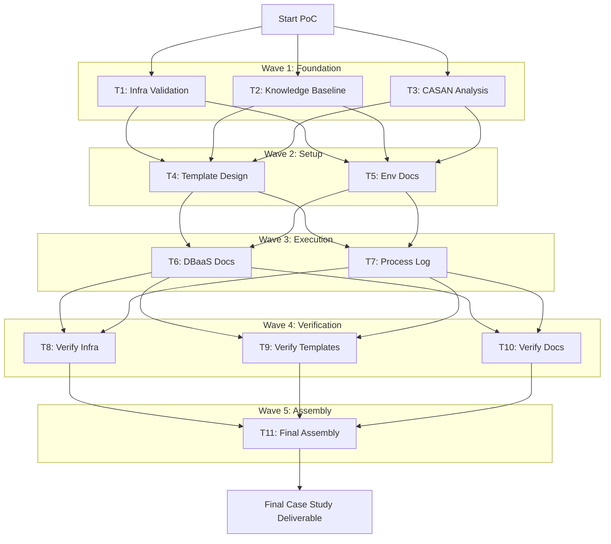

# GSD Wave Execution Flow

```mermaid
graph TD
    Start["Start PoC"]

    subgraph Wave1["Wave 1: Foundation"]
        T1["T1: Infra Validation"]
        T2["T2: Knowledge Baseline"]
        T3["T3: CASAN Analysis"]
    end

    subgraph Wave2["Wave 2: Setup"]
        T4["T4: Template Design"]
        T5["T5: Env Docs"]
    end

    subgraph Wave3["Wave 3: Execution"]
        T6["T6: DBaaS Docs"]
        T7["T7: Process Log"]
    end

    subgraph Wave4["Wave 4: Verification"]
        T8["T8: Verify Infra"]
        T9["T9: Verify Templates"]
        T10["T10: Verify Docs"]
    end

    subgraph Wave5["Wave 5: Assembly"]
        T11["T11: Final Assembly"]
    end

    Final["Final Case Study Deliverable"]

    Start --> T1
    Start --> T2
    Start --> T3

    T1 --> T4
    T2 --> T4
    T3 --> T4
    T1 --> T5
    T2 --> T5
    T3 --> T5

    T4 --> T6
    T5 --> T6
    T4 --> T7
    T5 --> T7

    T6 --> T8
    T7 --> T8
    T6 --> T9
    T7 --> T9
    T6 --> T10
    T7 --> T10

    T8 --> T11
    T9 --> T11
    T10 --> T11

    T11 --> Final
```
