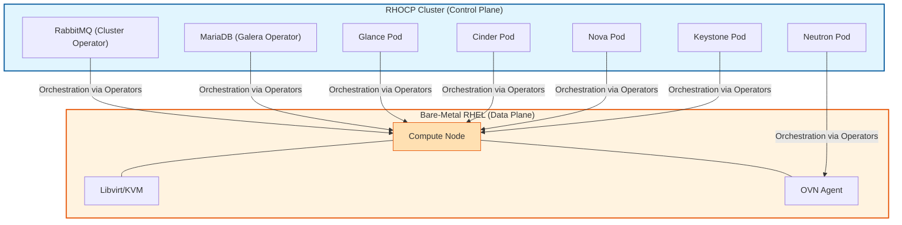
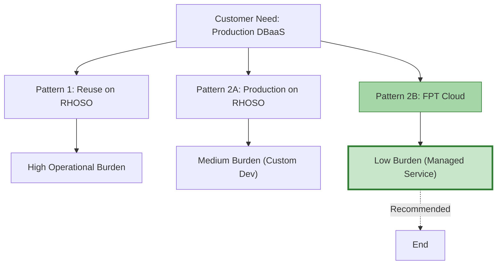

# RHOSO Architecture Diagrams

## Diagram 1: High-Level RHOSO Architecture

```mermaid
graph TB
    subgraph RHOCP["RHOCP Cluster (Control Plane)"]
        direction TB
        Keystone["Keystone Pod"]
        Nova["Nova Pod"]
        Neutron["Neutron Pod"]
        Cinder["Cinder Pod"]
        Glance["Glance Pod"]
        MariaDB["MariaDB (Galera Operator)"]
        RabbitMQ["RabbitMQ (Cluster Operator)"]
    end

    subgraph BareMetal["Bare-Metal RHEL (Data Plane)"]
        direction TB
        ComputeNode["Compute Node"]
        Libvirt["Libvirt/KVM"]
        OVNAgent["OVN Agent"]
    end

    Keystone -->|Orchestration via Operators| ComputeNode
    Nova -->|Orchestration via Operators| ComputeNode
    Neutron -->|Orchestration via Operators| OVNAgent
    Cinder -->|Orchestration via Operators| ComputeNode
    Glance -->|Orchestration via Operators| ComputeNode
    MariaDB -->|Orchestration via Operators| ComputeNode
    RabbitMQ -->|Orchestration via Operators| ComputeNode

    ComputeNode --- Libvirt
    ComputeNode --- OVNAgent

    style RHOCP fill:#e1f5fe,stroke:#01579b,stroke-width:2px
    style BareMetal fill:#fff3e0,stroke:#e65100,stroke-width:2px
    style ComputeNode fill:#ffe0b2,stroke:#e65100
```

## Diagram 2: DBaaS Architecture Patterns Comparison

```mermaid
flowchart TD
    Start["Customer Need: Production DBaaS"]

    Start --> Pattern1["Pattern 1: Reuse on RHOSO"]
    Start --> Pattern2A["Pattern 2A: Production on RHOSO"]
    Start --> Pattern2B["Pattern 2B: FPT Cloud"]

    Pattern1 --> Burden1["High Operational Burden"]
    Pattern2A --> Burden2A["Medium Burden (Custom Dev)"]
    Pattern2B --> Burden2B["Low Burden (Managed Service)"]

    style Burden2B fill:#c8e6c9,stroke:#2e7d32,stroke-width:3px
    style Pattern2B fill:#a5d6a7,stroke:#2e7d32

    Burden2B -.->|Recommended| End
```
