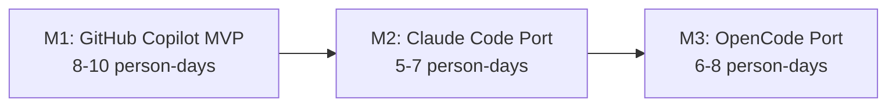

# AI-SDLC Integration Framework — Architecture Design Document

> **Version**: 1.0  
> **Status**: Approved  
> **Last Updated**: 2026-05-26  
> **Owner**: AI-SDLC Core Team

---

## Executive Summary

The AI-SDLC Integration Framework connects four AI-powered systems into a unified software delivery pipeline:

1. **GSD Redux** — Project planning and phase orchestration
2. **OMO/OpenCode** — Task execution and agent orchestration  
3. **AI-in-sdlc** — SDLC governance, artifact management, and 7-phase delivery
4. **agent-for-ba** — Business analysis, requirements engineering, and domain modeling

Instead of building a heavy central orchestrator, the framework uses a **Convention Layer (Model B)** topology: lightweight, file-based adapters that bridge between systems while preserving each system's autonomy and knowledge base ownership.

**Key Design Decisions**:
- Each system owns its own KB directory (`.planning/`, `.sdlc/`, `wiki/`)
- Handoffs are asynchronous and file-based
- No custom orchestration engine — reuse GSD phases + OMO tasks
- Human gates at architecture changes, API contract changes, and PR merges

**Estimated Effort**: 21–25 person-days across 3 milestones (M1: Copilot MVP → M2: Claude Code → M3: OpenCode + GSD)

---

## Table of Contents

1. [Integration Topology & Data Flow](#1-integration-topology--data-flow)
2. [Cross-System Phase Mapping](#2-cross-system-phase-mapping)
3. [Handoff Contracts](#3-handoff-contracts)
4. [State Synchronization](#4-state-synchronization)
5. [Safety Mechanisms](#5-safety-mechanisms)
6. [Implementation Roadmap](#6-implementation-roadmap)
7. [Getting Started](#7-getting-started)
8. [Architecture Decision Records](#8-architecture-decision-records)
9. [References](#9-references)

---

## 1. Integration Topology & Data Flow

### 1.1 Knowledge Base Ownership

| System | Primary KB Directory | Authority |
|--------|----------------------|-----------|
| **GSD Redux** | `.planning/` | Owns execution phases, project roadmap, and state tracking |
| **agent-for-ba** | `wiki/` | Owns domain knowledge, requirements, UI specs |
| **AI-in-sdlc** | `.sdlc/` | Owns technical artifacts, code metadata, test cases |
| **Integration Layer** | `.sdlc/integration/` | Owns mapping contracts, handoff state, sync metadata |

### 1.2 Data Flow Diagram

```mermaid
flowchart TD
    subgraph BA["agent-for-ba (Planning/Analysis)"]
        WIKI[wiki/ Knowledge Base]
    end

    subgraph ORCH["GSD Redux (Orchestration)"]
        PLAN[.planning/ PLAN.md]
        STATE[.planning/ STATE.md]
    end

    subgraph DEV["AI-in-sdlc + OMO (Execution)"]
        SDLC[.sdlc/ Artifacts]
        OMO[OMO task() / Agents]
    end

    WIKI -->|BA Artifact Adapter| SDLC
    PLAN -->|GSD to OMO Adapter| OMO
    OMO -->|State Sync| STATE
    SDLC -->|Status Update| WIKI
```

### 1.3 Adapter Interfaces

| Adapter | Source | Target | Trigger |
|---------|--------|--------|---------|
| BA→Dev Artifact Adapter | `wiki/projects/{project}/` | `.sdlc/artifacts/` | BA marks artifact as "approved" |
| GSD→OMO Task Adapter | `.planning/PLAN.md` | OMO `task()` calls | GSD `execute-phase` starts |
| State Sync Adapter | OMO execution logs | `.planning/STATE.md` | Task completion or failure |

**See**: [INTEGRATION-TOPOLOGY.md](INTEGRATION-TOPOLOGY.md) for full topology specification.  
**See**: [DECISIONS/ADR-016-file-based-integration.md](../DECISIONS/ADR-016-file-based-integration.md) for integration pattern ADR.  
**See**: [DECISIONS/ADR-017-distributed-kb-ownership.md](../DECISIONS/ADR-017-distributed-kb-ownership.md) for KB ownership ADR.

---

## 2. Cross-System Phase Mapping

### 2.1 Phase Mapping Matrix

| Stage | agent-for-ba (5 Steps) | GSD Redux Phases | AI-in-sdlc (7 Phases) |
|-------|-------------------------|------------------|-----------------------|
| **Discovery** | 1. Domain Analysis | `plan-milestone` | **Intake** |
| **Requirements** | 2. High-Level Req | `plan-phase` | **Intake** (Update) |
| **Specification** | 3. Detailed Req<br>4. UI Spec | `plan-phase` | **Define** |
| **Design** | 5. Review & Finalize | `discuss-phase` | **Decide** |
| **Implementation** | *Handoff to Dev* | `execute-phase` | **Produce** |
| **Validation** | — | `verify-work` | **Verify** |
| **Review** | — | `audit-milestone` | **Approve** (Human Gate) |
| **Deployment** | — | `complete-milestone` | **Integrate** |

### 2.2 Phase Equivalence & Rationale

- **BA Steps 1-2 ↔ Intake**: BA's early exploration maps to AI-in-sdlc's Intake phase where the work item is initialized and scoped.
- **BA Steps 3-4 ↔ Define**: Detailed requirements and UI specs establish the "Definition of Done", mapping to AI-in-sdlc's Define phase.
- **GSD `execute-phase` ↔ Produce**: GSD's execution wave maps to the Produce phase where code and tests are generated.
- **GSD `verify-work` ↔ Verify**: Automated verification and QA testing.
- **GSD `audit-milestone` ↔ Approve**: Critical Human Gate where PMs/Tech Leads review before integration.

### 2.3 Phase Skipping Rules

| Scenario | Skipped Phases | Condition |
|----------|---------------|-----------|
| Bug Fix (No UI) | BA Steps 3-4, UI Spec | Trivial fix with regression test |
| Backend-Only Feature | BA Step 4 (UI Spec) | No user interface changes |
| Greenfield Project | None | Full pipeline required |
| Brownfield Update | BA Step 1 (Domain Analysis) | Existing mature domain KB |

**See**: [PHASE-MAPPING.md](PHASE-MAPPING.md) for full mapping specification.

---

## 3. Handoff Contracts

### 3.1 BA → Dev Handoff Contract

**Flow**: `wiki/projects/{project}/` → `.sdlc/artifacts/`

**Artifact Types Supported**:
1. **Requirement** (`REQ-xxx`) → `.sdlc/artifacts/requirement/`
2. **UI Specification** (`UI-xxx`) → `.sdlc/artifacts/design-artifact/`
3. **Test Case** (`TC-xxx`) → `.sdlc/artifacts/test-case/`
4. **Review Report** (`REV-xxx`) → `.sdlc/artifacts/review-note/`

**Validation Rules**:
- All required frontmatter fields present (`id`, `title`, `type`, `status`, `created_by`, `created_at`)
- Status must be `approved` for Dev consumption
- Acceptance criteria must have ≥ 1 checkbox item
- Cross-artifact consistency: all `related_requirements` must exist

**Versioning**: When BA updates an artifact, the adapter creates a new version, marks dependent artifacts as `draft` for re-validation, and preserves the old version via `supersedes` field.

### 3.2 GSD → OMO Handoff Contract

**Flow**: `.planning/PLAN.md` → OMO `task()` invocations

**Task Field Mapping**:

| GSD Field | OMO Parameter | Mapping Rule |
|-----------|--------------|--------------|
| Task Title | `description` | Truncate to 3–5 words |
| Description bullets | `prompt` | Concatenate into prompt block |
| Must NOT do bullets | `prompt` (appended) | Append as Guardrails section |
| Category hint | `category` | Map directly; fallback `"deep"` |
| Skills list | `load_skills` | Pass as string array |
| Can Run In Parallel | `run_in_background` | `YES` → `true`; `NO` → `false` |
| Acceptance Criteria | `prompt` (appended) | Append as checklist |

**Wave Dispatch Rules**:
- Wave N tasks with `Can Run In Parallel: YES` → dispatch with `run_in_background=true`
- Wait for ALL Wave N tasks to complete before dispatching Wave N+1
- If any task fails, halt wave advancement and invoke replanning protocol

**State Feedback**: OMO writes structured results back to `.planning/STATE.md` and patches `boulder.json` with task status, commit hash, and evidence paths.

**See**: [HANDOFF-CONTRACTS.md](HANDOFF-CONTRACTS.md) for full contract specification with examples.

---

## 4. State Synchronization

### 4.1 Canonical State Ownership

| State Type | Owner | Location |
|------------|-------|----------|
| Project roadmap & phases | GSD Redux | `.planning/PLAN.md`, `.planning/STATE.md` |
| Work items & executions | AI-in-sdlc | `.sdlc/work-items/`, `.sdlc/executions/` |
| Requirements & design | agent-for-ba | `wiki/projects/{project}/` |
| Integration metadata | Integration Layer | `.sdlc/integration/sync/` |

### 4.2 Sync Rules

1. **BA → Dev**: When BA marks artifact as `approved`, adapter converts and writes to `.sdlc/artifacts/`. Dev skills poll `.sdlc/artifacts/` for new inputs.
2. **GSD → OMO**: When GSD enters `execute-phase`, adapter parses `PLAN.md` and dispatches tasks to OMO. OMO updates `STATE.md` on completion.
3. **OMO → GSD**: Task completion triggers `STATE.md` update. GSD reads state to determine wave advancement.

### 4.3 Conflict Detection & Resolution

**Conflict Detection**:
- Phase mismatch: GSD says "In Progress" but AI-in-sdlc says "Approved"
- Artifact version mismatch: BA updated requirement but Dev consumed old version
- Circular dependencies: Task A blocks Task B and Task B blocks Task A

**Resolution Protocol**:
1. Detect conflict via state comparison
2. Log conflict to `.sdlc/integration/conflicts/`
3. Surface to user with affected tasks and recommended action
4. **Human gate**: User decides which system state is canonical
5. Adapter re-syncs downstream systems

**See**: [STATE-SYNC.md](STATE-SYNC.md) for full sync protocol specification.

---

## 5. Safety Mechanisms

### 5.1 Circuit Breakers

| Condition | Action |
|-----------|--------|
| > 3 consecutive task failures in a wave | Halt wave; require human review before continuing |
| > 5 tasks dispatched without human gate | Force Approve gate on next architecture-touching task |
| Task execution time > 30 min | Timeout and mark as failed |
| `.sdlc/` or `.planning/` corruption detected | Halt all automation; require manual recovery |

### 5.2 Replanning Detection

**Triggers**:
- `PLAN.md` modified mid-execution (checksum mismatch)
- Task acceptance criteria changed after dispatch
- New `Blocked By` dependency added to running task

**Protocol**:
1. Detect change via file watcher or git diff
2. Halt affected wave
3. Surface replanning notification to user
4. Options: [1] Retry with new plan, [2] Continue with old plan, [3] Abort wave

### 5.3 Rollback Protocol

1. Identify last known good state from `boulder.json` history
2. Restore `PLAN.md` and `STATE.md` from git history
3. Mark all downstream tasks as `pending`
4. Re-dispatch from restored state

### 5.4 Ultrawork Bounds

`/ulw-loop` (ultrawork mode) can:
- ✅ Execute multiple waves autonomously
- ✅ Auto-retry failed tasks (max 2 retries)
- ✅ Skip trivial Approve gates (auto-pass if no risk flags)
- ❌ Modify architecture without human gate
- ❌ Add new external dependencies without approval
- ❌ Override circuit breaker halt conditions

**See**: [SAFETY-MECHANISMS.md](SAFETY-MECHANISMS.md) for full safety specification.

---

## 6. Implementation Roadmap

### 6.1 Milestone Overview



| Milestone | Goal | Duration | Risk |
|-----------|------|----------|------|
| **M1** | Prove phase engine and KB end-to-end on Copilot | 8–10 days | Medium |
| **M2** | Port to Claude Code with parallel execution | 5–7 days | Low |
| **M3** | Deep GSD integration with OpenCode | 6–8 days | Medium |

**Critical Path**: M1 → M2 → M3  
**Total Effort**: 21–25 person-days

### 6.2 M1: GitHub Copilot MVP

**Phase 1 — Core Infrastructure (Days 1–3)**:
- `.sdlc/` schema implementation (WorkItem, Artifact, Decision, Execution, PhasePacket)
- `LocalFileAdapter` for read/write/search
- `project.yaml` adaptation profile
- 7 phase agent skeletons
- Handoff chain wiring

**Phase 2 — Skills (Days 4–6)**:
- `start-feature/SKILL.md`
- `fix-bug/SKILL.md`
- `update-requirements/SKILL.md`
- Approve gate artifacts

**Phase 3 — Test Skills (Days 7–8)**:
- `write-unit-tests/SKILL.md`
- `write-auto-tests/SKILL.md`
- Traceability linking

**Phase 4 — External Providers (Days 9–10)**:
- Jira MCP adapter
- Figma MCP adapter
- OpenAPI ingestor
- Bulk ingestor CLI

### 6.3 M2: Claude Code Port

- Port all M1 skills to `.claude/skills/`
- Reimplement phase engine as sequential subagent loop
- Parallel Produce phase (API + UI agents simultaneously)
- Cross-session memory via `phloem_remember`
- Interactive human gates

### 6.4 M3: OpenCode Port

- Skills as OMO slash commands
- Phase engine integrated with OMO task/todo system
- `.sdlc/` and `.planning/` coexistence
- GSD phase directories mapped to `.sdlc/phases/`
- Human gates via `question` tool

**See**: [IMPLEMENTATION-ROADMAP.md](IMPLEMENTATION-ROADMAP.md) for full roadmap with effort estimates, risk mitigation, and success metrics.

---

## 7. Getting Started

### 7.1 For New Team Members

1. **Read this document** — Understand the topology, phase mapping, and handoff contracts
2. **Read your system's conventions**:
   - GSD Redux: See `docs/spikes/system-conventions.md` §GSD
   - AI-in-sdlc: See `ARCHITECTURE.md`
   - agent-for-ba: See `docs/spikes/system-conventions.md` §BA
3. **Understand the handoff boundaries**:
   - BA writes to `wiki/`, never to `.sdlc/` or `.planning/`
   - GSD writes to `.planning/`, never to `.sdlc/` or `wiki/`
   - Dev reads from `.sdlc/`, consumes BA artifacts via adapter
4. **Run the validation spikes**:
   ```bash
   bash scripts/spike-gsd-omo-handoff.sh --input test/fixtures/sample-plan.md
   bash scripts/spike-ba-dev-artifact-flow.sh --input test/fixtures/sample-ba-hlr.md --type high-level-req
   ```

### 7.2 For Project Leads

1. **Set up KB directories**:
   ```bash
   mkdir -p .planning/ .sdlc/ wiki/
   ```
2. **Configure `.gitignore`**:
   ```
   .sdlc/.env
   .sdlc/.secrets/
   .planning/.env
   ```
3. **Initialize GSD**: Follow GSD Redux setup guide
4. **Initialize AI-in-sdlc**: Run `/sdlc-init` in Copilot Chat
5. **Initialize BA wiki**: Follow agent-for-ba wiki setup

### 7.3 Integration Checklist

- [ ] All 4 systems installed and configured
- [ ] `.planning/`, `.sdlc/`, `wiki/` directories created
- [ ] Adapter scripts tested with sample fixtures
- [ ] First handoff executed successfully (BA → Dev or GSD → OMO)
- [ ] Human gate workflow tested
- [ ] Safety mechanisms verified (circuit breakers, rollback)

---

## 8. Architecture Decision Records

| ADR | Title | Status |
|-----|-------|--------|
| ADR-016 | [File-based Convention Layer Integration](../DECISIONS/ADR-016-file-based-integration.md) | Accepted |
| ADR-017 | [Distributed Knowledge Base Ownership](../DECISIONS/ADR-017-distributed-kb-ownership.md) | Accepted |
| ADR-018 | [Asynchronous Handoff Protocol](../DECISIONS/ADR-018-asynchronous-handoff.md) | Accepted |

**See**: [DECISIONS.md](../DECISIONS.md) for all 15+ ADRs.

---

## 9. References

### Design Documents
- [INTEGRATION-TOPOLOGY.md](INTEGRATION-TOPOLOGY.md) — Topology & data flow
- [PHASE-MAPPING.md](PHASE-MAPPING.md) — Cross-system phase mapping
- [HANDOFF-CONTRACTS.md](HANDOFF-CONTRACTS.md) — BA→Dev and GSD→OMO contracts
- [STATE-SYNC.md](STATE-SYNC.md) — State synchronization protocol
- [SAFETY-MECHANISMS.md](SAFETY-MECHANISMS.md) — Safety mechanisms
- [IMPLEMENTATION-ROADMAP.md](IMPLEMENTATION-ROADMAP.md) — Phased implementation plan

### Spike Results
- [docs/spikes/gsd-omo-handoff.md](spikes/gsd-omo-handoff.md) — GSD→OMO handoff feasibility
- [docs/spikes/ba-dev-artifact-flow.md](spikes/ba-dev-artifact-flow.md) — BA→Dev artifact flow feasibility
- [docs/spikes/directory-coexistence.md](spikes/directory-coexistence.md) — Cross-system file coexistence
- [docs/spikes/system-conventions.md](spikes/system-conventions.md) — System conventions research

### Framework Documents
- [ARCHITECTURE.md](../ARCHITECTURE.md) — AI-in-sdlc architecture
- [DECISIONS.md](../DECISIONS.md) — Architecture Decision Records
- [ROADMAP.md](../ROADMAP.md) — Original milestone definitions

### Adapter Scripts
- [scripts/spike-gsd-omo-handoff.sh](../scripts/spike-gsd-omo-handoff.sh) — GSD→OMO handoff spike
- [scripts/spike-ba-dev-artifact-flow.sh](../scripts/spike-ba-dev-artifact-flow.sh) — BA→Dev artifact flow spike

---

*End of Architecture Design Document*
