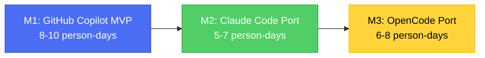

# AI-SDLC Integration Framework — Implementation Roadmap

> Phased delivery plan from GitHub Copilot MVP through OpenCode integration with deep GSD integration.

**Status**: Living roadmap  
**Last Updated**: 2026-05-26  
**Owner**: AI-SDLC Core Team

---

## Executive Summary

This roadmap defines the sequential delivery of the AI-SDLC Integration Framework across three runtime targets:

1. **Milestone 1 (M1)**: GitHub Copilot MVP — proves the phase engine and knowledge base work end-to-end
2. **Milestone 2 (M2)**: Claude Code Port — unlocks parallel execution and cross-session memory
3. **Milestone 3 (M3)**: OpenCode Port — deep GSD integration with slash commands and task orchestration

Each milestone builds on the previous one. The `.sdlc/` artifact schema remains identical across all runtimes — only the skill injection mechanism and orchestration model change.

---

## Milestone Overview



### Dependency Graph

| Milestone | Depends On | Blocks |
|-----------|-----------|--------|
| **M1** | None (foundational) | M2, M3 |
| **M2** | M1 Phase 1 complete (schema + adapter) | M3 |
| **M3** | M2 complete (autonomous patterns proven) | Production rollout |

**Critical Path**: M1 → M2 → M3  
**Total Estimated Effort**: 19–25 person-days

---

## Milestone 1: GitHub Copilot MVP

**Goal**: A working toolset for GitHub Copilot (VS Code Agent Mode) covering the two most common developer intents: `start-feature` and `fix-bug`. Proves the phase engine and knowledge base work end-to-end on a real project.

**Target Duration**: 8–10 person-days  
**Risk Level**: Medium (unproven handoff chain pattern)

### Phase 1 — Core Infrastructure (Days 1–3)

**Deliverables**:
- [ ] `.sdlc/` directory schema implemented:
  - `WorkItem` — task tracking
  - `Artifact` + `ArtifactVersion` — requirements, design docs, test cases
  - `Decision` — ADRs and design rationale
  - `Execution` — phase execution logs
  - `PhasePacket` — state passed between phases
- [ ] `LocalFileAdapter` — read/write/search over `.sdlc/` files
- [ ] `project.yaml` adaptation profile schema + loader
- [ ] `copilot-instructions.md` — always-on project context injection
- [ ] Phase agent skeleton (7 agents):
  - `intake.agent.md`, `define.agent.md`, `decide.agent.md`
  - `produce.agent.md`, `verify.agent.md`, `approve.agent.md`, `integrate.agent.md`
- [ ] Handoff chain wiring (each agent → next via `send: false` buttons)

**Human Gate Implementation**:
- Approve phase: agent outputs review package → user opens artifact → reports back in chat

**Success Criteria**:
- Developer can run through all 7 phases manually (clicking handoff buttons)
- State is persisted in `.sdlc/` between sessions
- PhasePacket written at end of each phase, readable by next phase agent

**Effort**: 3 person-days

---

### Phase 2 — Skills: `start-feature` + `fix-bug` (Days 4–6)

**Deliverables**:
- [ ] `start-feature/SKILL.md` — full phase projection, acceptance criteria gathering, design decision capture
- [ ] `fix-bug/SKILL.md` — bug reproduction, root cause analysis, minimal fix plan
- [ ] `update-requirements/SKILL.md` — requirement structuring + invalidation propagation
- [ ] Adaptation profile injection: project stack + component profile loaded per skill invocation
- [ ] Approve gate artifacts: excalidraw diagram generation for architecture decisions

**Success Criteria**:
- Developer types `/start-feature` in Copilot Chat, completes a full feature cycle end-to-end
- All decisions, artifacts, and executions recorded in `.sdlc/`
- Approve gate correctly triggers for architecture changes, auto-passes for trivial changes

**Effort**: 3 person-days

---

### Phase 3 — Skills: `write-unit-tests` + `write-auto-tests` (Days 7–8)

**Deliverables**:
- [ ] `write-unit-tests/SKILL.md` — coverage gap analysis, test seam identification, test generation
- [ ] `write-auto-tests/SKILL.md` — flow extraction from design artifacts, E2E script generation
- [ ] Traceability: generated tests linked to requirements in `.sdlc/`
- [ ] Coverage threshold check in Verify phase (auto-pass gate)

**Success Criteria**:
- Developer types `/write-unit-tests`, agent generates tests with correct coverage for the given requirements
- Tests are linked to requirement `ArtifactVersion` records in `.sdlc/`

**Effort**: 2 person-days

---

### Phase 4 — External Providers (MVP Integrations) (Days 9–10)

**Deliverables**:
- [ ] Jira MCP server configuration + `JiraProviderAdapter` (normalize tickets → WorkItems + requirements)
- [ ] Figma MCP server configuration + `FigmaProviderAdapter` (normalize frames → design-artifact ArtifactVersions)
- [ ] OpenAPI `ApiSpecIngestor` (ingest API specs into knowledge base)
- [ ] `BulkIngestor` CLI: `sdlc ingest codebase`, `sdlc ingest docs`, `sdlc ingest jira`

**Fallback** (for Enterprise where MCP is disabled):
- Documented workflow for manually pasting Jira/Figma content + agent normalization step

**Success Criteria**:
- Developer runs `sdlc ingest jira --project PROJ`, requirements appear in `.sdlc/artifacts/requirement/`
- Figma mockup imported via MCP, available as `design-artifact` in knowledge base, linked to requirement

**Effort**: 2 person-days

---

### Phase 5 — Pilot on Real Project (Post-M1, ongoing)

**Goal**: Validate framework on one real project with a real team.

**Activities**:
- Onboard one project (run `sdlc ingest codebase` + `sdlc ingest docs`)
- Team uses `start-feature` and `fix-bug` for 2–4 weeks
- Collect: which phases are skipped, which gates are clicked through without reading, which skills feel too heavy

**Prune Criteria** (per ADR-001):
- If a phase is consistently skipped → make it optional by default in skill config
- If a gate is consistently rubber-stamped → convert to auto-pass with evidence
- If a skill feels like mini-waterfall → reduce required phases to minimum viable

**Milestone 1 Done When**:
- [ ] Two skills (`start-feature`, `fix-bug`) used in production on one project
- [ ] Knowledge base populated and queried by agents
- [ ] At least one external provider (Jira or Figma) integrated
- [ ] Pilot feedback incorporated

**Effort**: Not counted in M1 development (validation phase)

---

## Milestone 2: Claude Code Port

**Goal**: Port the framework to Claude Code CLI. Leverage background parallelism and cross-session memory unavailable in Copilot.

**Target Duration**: 5–7 person-days  
**Risk Level**: Low (schema proven in M1, porting work only)

### Key Porting Tasks

| Component | Copilot (M1) | Claude Code (M2) | Effort |
|-----------|-------------|-----------------|--------|
| Phase engine | Handoff chain (`.agent.md`) | Sequential `Task` subagent calls in SKILL.md loop | 1 day |
| Skill loading | `.github/skills/*/SKILL.md` | `.claude/skills/*/SKILL.md` | 0.5 days |
| Human gates | Handoff buttons (`send: false`) | Interactive prompts + `--dangerously-skip-permissions` off | 1 day |
| Parallel execution | ❌ | ✅ Background tasks for within-phase parallelism | 1.5 days |
| Cross-session memory | Files only | `phloem_remember` + files | 1 day |
| Autonomy level | Per-session user opt-in | Default autonomous, gates at key points | 0.5 days |

**New Capabilities Unlocked in M2**:
- Parallel subagents within Produce phase (API agent + UI agent run simultaneously)
- Cross-session memory: past decisions and patterns remembered without re-reading files
- Autonomous mode: full `start-feature` cycle without clicking handoff buttons

**Deliverables**:
- [ ] All M1 skills ported to `.claude/skills/`
- [ ] Phase engine re-implemented as sequential subagent loop
- [ ] Parallel Produce phase working (two subagents for complex features)
- [ ] Cross-session memory reducing context load per invocation
- [ ] Human gates implemented as interactive prompts

**M2 Done When**:
- [ ] All M1 skills ported and working in Claude Code
- [ ] Parallel Produce phase working (two subagents for complex features)
- [ ] Cross-session memory reducing context load per invocation

**Total Effort**: 5–7 person-days

---

## Milestone 3: OpenCode Port

**Goal**: Port to OpenCode (OMO), with deep GSD integration.

**Target Duration**: 6–8 person-days  
**Risk Level**: Medium (GSD integration complexity)

### Key Additions vs M2

| Feature | M2 (Claude Code) | M3 (OpenCode) | Effort |
|---------|-----------------|---------------|--------|
| Skills loadable via | Manual invocation | `load_skills=[...]` in `task()` calls | 1 day |
| Skills surfaced as | Slash commands | OMO slash commands + `task()` delegation | 1 day |
| Phase engine runs as | Subagent loop | OMO orchestration loop (Sisyphus orchestrates phase subagents) | 2 days |
| GSD phase directories | N/A | Mapped to `.sdlc/phases/` | 1 day |
| Integration with OMO | N/A | Todo system, background tasks, question tool for gates | 2 days |

**Deliverables**:
- [ ] Skills available as OMO slash commands
- [ ] Phase engine integrated with OMO's task/todo system
- [ ] `.sdlc/` and `.planning/` coexist cleanly (GSD for project phases, `.sdlc/` for SDLC artifacts)
- [ ] GSD-style phase directories mapped to `.sdlc/phases/`
- [ ] Human gates implemented via `question` tool

**Integration Topology**:

```
GSD Redux (.planning/)  →  OMO task() calls  →  AI-in-sdlc (.sdlc/)
       ↑                                              ↓
       └────────── State Sync via files ──────────────┘
```

**M3 Done When**:
- [ ] All skills available as OMO slash commands
- [ ] Phase engine integrated with OMO's task/todo system
- [ ] `.sdlc/` and `.planning/` coexist cleanly (GSD for project phases, `.sdlc/` for SDLC artifacts)

**Total Effort**: 6–8 person-days

---

## Effort Summary

| Milestone | Phase | Effort (person-days) | Cumulative |
|-----------|-------|---------------------|------------|
| **M1** | Phase 1: Core Infrastructure | 3 | 3 |
| **M1** | Phase 2: start-feature + fix-bug | 3 | 6 |
| **M1** | Phase 3: write-unit-tests + write-auto-tests | 2 | 8 |
| **M1** | Phase 4: External Providers | 2 | 10 |
| **M1** | Phase 5: Pilot (validation, not dev) | — | 10 |
| **M2** | Port to Claude Code | 5–7 | 15–17 |
| **M3** | Port to OpenCode + GSD integration | 6–8 | 21–25 |

**Total Estimated Effort**: 21–25 person-days (excluding pilot validation)

---

## Risk Mitigation

### Technical Risks

| Risk | Impact | Likelihood | Mitigation |
|------|--------|------------|------------|
| Handoff chain pattern fails in M1 | High | Low | Fallback: simple sequential prompts without `send: false` |
| MCP disabled in Enterprise | Medium | Medium | Documented manual paste workflow (ADR-004) |
| GSD integration conflicts | Medium | Low | Clear KB boundaries: `.planning/` vs `.sdlc/` (ADR-016) |
| Model routing complexity | Low | Medium | Centralized `models.yaml` config (ADR-014) |

### Schedule Risks

| Risk | Impact | Mitigation |
|------|--------|------------|
| M1 Phase 1 takes longer than 3 days | Delays all milestones | Parallelize: one dev on schema, one on adapter |
| Pilot feedback requires major rework | Delays M2 start | Build prune criteria into M1 (ADR-001) |
| Claude Code API changes | Delays M2 | Monitor Claude Code release notes weekly |

---

## Success Metrics

### M1 Success Metrics
- ✅ Two skills used in production on one project
- ✅ Knowledge base populated with ≥100 artifacts
- ✅ At least one external provider (Jira or Figma) integrated
- ✅ Pilot feedback incorporated into skill configs

### M2 Success Metrics
- ✅ All M1 skills ported and working in Claude Code
- ✅ Parallel Produce phase reduces implementation time by ≥30%
- ✅ Cross-session memory reduces context load by ≥50% (fewer file reads)

### M3 Success Metrics
- ✅ All skills available as OMO slash commands
- ✅ Phase engine integrated with OMO's task/todo system
- ✅ Zero conflicts between `.sdlc/` and `.planning/` directories

---

## Open Questions Blocking Roadmap

| Question | Blocks | Resolution Target | Owner |
|----------|--------|-------------------|-------|
| OQ-003: Should `.sdlc/` be git-committed by default? | M1 Phase 1 | Before Phase 1 ships | Tech Lead |
| OQ-004: Model routing per phase? | M1 Phase 2 | Before skill implementation | Tech Lead |

**Note**: OQ-003 resolved in ADR-013 (yes, commit `.sdlc/` except credentials). OQ-004 resolved in ADR-014 (centralized `models.yaml` with tier aliases).

---

## Next Steps

1. **Immediate**: Complete M1 Phase 1 (Core Infrastructure)
2. **Week 2**: Implement M1 Phase 2 (start-feature + fix-bug skills)
3. **Week 3**: Implement M1 Phase 3 (test skills) + Phase 4 (providers)
4. **Week 4**: Begin pilot on real project
5. **Post-Pilot**: Port to Claude Code (M2)
6. **Post-M2**: Port to OpenCode with GSD integration (M3)

---

## References

- [ROADMAP.md](../ROADMAP.md) — Original milestone definitions
- [DECISIONS.md](../DECISIONS.md) — 15 Architecture Decision Records
- [ARCHITECTURE.md](../ARCHITECTURE.md) — Phase model and schema
- [docs/PHASE-MAPPING.md](PHASE-MAPPING.md) — Cross-system phase mapping
- [docs/INTEGRATION-TOPOLOGY.md](INTEGRATION-TOPOLOGY.md) — Data flow and adapter design
- [docs/deliverables-matrix.md](deliverables-matrix.md) — Artifact expectation matrix
- [docs/skill-authoring-guide.md](skill-authoring-guide.md) — Skill development standards
