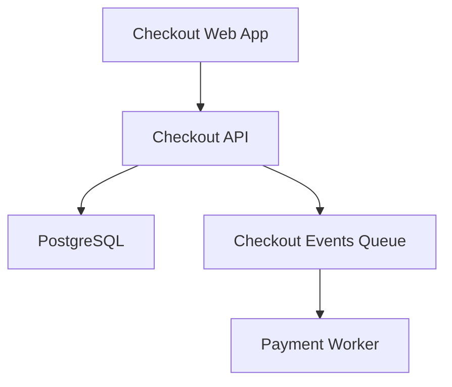
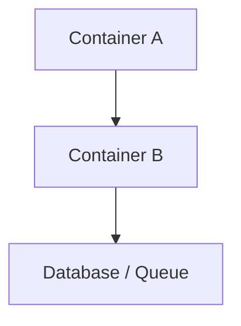

# Template: `container-view`

> Reusable template for a `design-artifact` with `artifact_subtype: container-view`.

**Status**: Draft framework template.
**Purpose**: Standardize how AI-in-SDLC represents the main deployable or runtime units inside a system/subsystem and the major relationships between those units.

---

## When to use this template

Use a `container-view` when the active scope needs to answer:

- What are the main runtime or deployable units inside this system or subsystem?
- Which applications, services, databases, queues, or worker processes exist?
- What responsibility does each unit own?
- How do the major units communicate with each other?

Typical triggers:

- project initialization after the context-view is known
- brownfield architecture recovery for a system or subsystem
- release readiness for distributed or multi-runtime systems
- requirement or review work that crosses service, app, or storage boundaries
- onboarding where service/app boundaries are unclear

---

## Scope compatibility

Recommended `scope_type` values:

- `system`
- `subsystem`

Avoid using `container-view` for:

- external system boundary mapping only → use `context-view`
- internal module/class structure → use `component-view`
- one request/flow over time → use `interaction-view`
- infrastructure topology and node placement → use `deployment-view`

---

## Required metadata

Suggested `attributes.yaml`:

```yaml
artifact_subtype: container-view
scope_type: system
scope_ref: payments-platform
view_purpose: "Show the main deployable/runtime units inside the payments platform and the major relationships between them."
audience:
  - developer
  - reviewer
  - architect
  - operator
confidence_level: medium
validation_status: partially-validated
reconstructed_from:
  - code
  - infra
  - api-spec
source_artifact_version_ids: []
freshness_expectation: on-change
waiver_state: none
```

Minimum required fields for M1:

- `artifact_subtype`
- `scope_type`
- `scope_ref`
- `view_purpose`
- `confidence_level`
- `validation_status`

---

## Required content sections

Every `container-view` artifact should include these sections in `content.md`.

### 1. Scope statement

State clearly:

- what system or subsystem this view covers,
- what is in scope,
- and what is intentionally excluded.

Example:

> This view covers the deployable/runtime units inside the Checkout Platform. It includes the Web App, Checkout API, Payment Worker, PostgreSQL database, and message queue. External systems such as PSPs and fraud vendors are outside this view.

### 2. Container catalog

List the main runtime/deployable units in scope.

For each one, describe:

- name
- type
- primary responsibility
- technology or platform (if relevant)
- ownership notes (if relevant)

Typical container types:

- web app
- backend service
- worker
- database
- queue / event bus
- mobile client
- batch job

### 3. Major interfaces and responsibilities

Summarize what each container exposes or consumes.

Examples:

- Checkout API exposes purchase/session endpoints
- Payment Worker consumes payment-authorized events
- PostgreSQL stores order and payment state
- Queue carries checkout and payment lifecycle events

### 4. Communication edges

Describe the major runtime relationships between containers.

For each edge, capture:

- source
- target
- interaction type (`sync`, `async`, `storage`, `manual`)
- purpose

### 5. Storage and messaging notes

Explicitly call out:

- databases and ownership boundaries
- queues/event buses/topics
- shared storage or file/object storage
- whether data ownership is clear or risky

### 6. Operational / scaling notes

Capture high-level operational characteristics when relevant:

- autoscaling unit
- stateless vs stateful
- batch vs online
- latency-sensitive boundary
- failure isolation concerns

### 7. Open questions / assumptions

If the container-view was reconstructed or incomplete, record the uncertain parts.

Examples:

- worker ownership inferred from deployment manifest, not yet confirmed
- message queue topic names partially reconstructed from code constants

---

## Minimum visual content

Regardless of representation style, a valid `container-view` should show:

- the main in-scope containers,
- their primary relationships,
- clear distinction between app/service/worker/storage/messaging units,
- and enough labeling that a reviewer can tell what each container is for.

If the artifact is text-only, the same information must be expressed in structured Markdown.

---

## Supported representation styles

The framework should allow any of the following:

### Option A — Mermaid

Best for repo-native, text-first diagrams.



### Option B — Excalidraw

Best for collaborative architecture review and human-friendly communication.

Represent visually:

- app/service/worker boxes
- storage and queue units
- labeled arrows for the key relationships

### Option C — Structured Markdown only

Acceptable for early brownfield recovery or when the main need is architectural inventory rather than polished diagrams.

---

## Canonical `content.md` template

```markdown
# Container View: [System or Subsystem Name]

## Scope

- **Scope type**: [system | subsystem]
- **Scope ref**: [stable identifier]
- **In scope**: [what is included]
- **Out of scope**: [what is excluded]

## Purpose

[One paragraph explaining why this container-view exists and what architectural question it answers.]

## Container Catalog

| Container | Type | Responsibility | Technology / Platform | Notes |
|---|---|---|---|---|
| [name] | [web app / service / worker / database / queue] | [responsibility] | [stack] | [notes] |

## Interfaces and Responsibilities

- [container]: [what it exposes or consumes]
- [container]: [what it exposes or consumes]

## Communication Edges

| Source | Target | Interaction Type | Purpose |
|---|---|---|---|
| [container] | [container] | [sync/async/storage/manual] | [purpose] |

## Storage and Messaging Notes

- [database or storage note]
- [queue/event bus/topic note]
- [ownership boundary note]

## Operational Notes

- [scaling or runtime note]
- [stateful/stateless note]
- [failure isolation note]

## Representation

### Mermaid / Diagram



## Open Questions / Assumptions

- [question or assumption]
- [question or assumption]
```

---

## Review checklist

Before approving a `container-view`, verify:

- [ ] The scoped system/subsystem is clearly named.
- [ ] The major containers in scope are listed.
- [ ] Each container has a clear responsibility.
- [ ] Major relationships between containers are shown or described.
- [ ] Storage and messaging boundaries are identified.
- [ ] The view does not drift into component-level internals.
- [ ] Open assumptions are explicit if the artifact is reconstructed.

---

## Common mistakes to avoid

### 1. Context-view leakage

The artifact mostly describes external actors and upstream/downstream dependencies rather than the internal runtime units.

Fix: keep external systems in the context-view and focus this template on in-scope containers.

### 2. Component leakage

The artifact starts listing classes, packages, handlers, or module internals.

Fix: move those details into `component-view`.

### 3. Missing storage / queue boundaries

The service/app boxes are present, but databases, queues, or event buses are ignored even though they shape the architecture.

Fix: include the major state and messaging containers explicitly.

### 4. Diagram without responsibilities

The boxes exist, but a reader still cannot tell what each container owns.

Fix: add a catalog with responsibility text.

### 5. Unvalidated brownfield certainty

The view presents inferred topology as authoritative fact.

Fix: carry confidence and assumptions explicitly.

---

## Relationship to other templates

- Use `context-view` first to establish the outer boundary.
- Use `component-view` next when you need to zoom into one container’s internals.
- Use `interaction-view` when you need to explain a critical end-to-end flow across containers.
- Use `deployment-view` when you need to show where containers run physically or logically in infrastructure.
