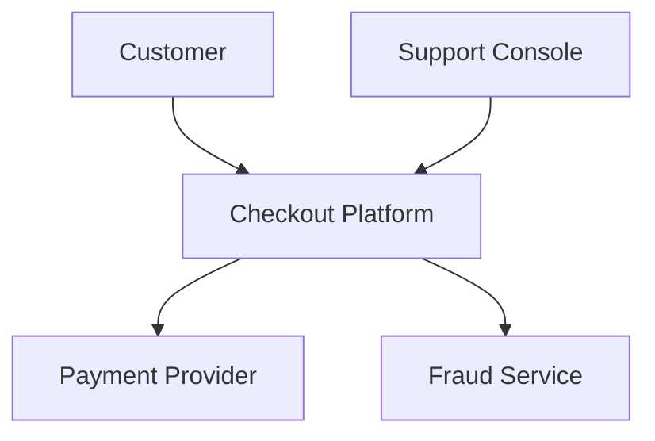
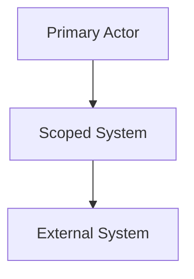

# Template: `context-view`

> Reusable template for a `design-artifact` with `artifact_subtype: context-view`.

**Status**: Draft framework template.
**Purpose**: Standardize how AI-in-SDLC represents system boundary, external actors, upstream/downstream dependencies, and major trust/integration edges.

---

## When to use this template

Use a `context-view` when the active scope needs to answer:

- What system or subsystem are we actually talking about?
- Who or what interacts with it?
- Which external systems, actors, or platforms are inside or outside the boundary?
- What major dependency edges matter for requirements, review, debugging, or release?

Typical triggers:

- greenfield project initialization
- brownfield architecture recovery
- onboarding to an unfamiliar system or subsystem
- requirement or review work involving multiple external systems
- release readiness when system boundaries are unclear

---

## Scope compatibility

Recommended `scope_type` values:

- `system`
- `subsystem`

Avoid using `context-view` for:

- low-level module internals → use `component-view`
- runtime request flow → use `interaction-view`
- infrastructure topology → use `deployment-view`

---

## Required metadata

Suggested `attributes.yaml`:

```yaml
artifact_subtype: context-view
scope_type: system
scope_ref: payments-platform
view_purpose: "Show the system boundary, external actors, and external systems that interact with the payments platform."
audience:
  - developer
  - reviewer
  - architect
confidence_level: medium
validation_status: partially-validated
reconstructed_from:
  - code
  - api-spec
  - legacy-doc
source_artifact_version_ids: []
freshness_expectation: on-change
waiver_state: none
```

Minimum required fields for M1:

- `artifact_subtype`
- `scope_type`
- `scope_ref`
- `view_purpose`
- `confidence_level`
- `validation_status`

---

## Required content sections

Every `context-view` artifact should include these sections in `content.md`.

### 1. Scope statement

State clearly:

- what system or subsystem this view covers,
- what is explicitly in scope,
- and what is explicitly out of scope.

Example:

> This view covers the Checkout Platform as a single business system. It includes the Checkout UI, Checkout API, Payment Gateway Adapter, and external merchant/payment integrations. Internal component/module structure is out of scope.

### 2. Primary actors

List the main humans, teams, or machine actors that interact with the scoped system.

Examples:

- end user
- back-office operator
- partner integration
- scheduled batch job
- internal service consumer

### 3. External systems and dependencies

List the systems outside the boundary that matter to this scope.

For each one, describe:

- name
- role
- dependency type
- whether the interaction is synchronous, asynchronous, or human/manual

### 4. Boundary and trust notes

Describe important boundaries such as:

- internal vs external systems
- customer-facing vs internal platform
- regulated or security-sensitive boundaries
- ownership boundaries across teams or vendors

### 5. Key integration edges

Summarize the major flows or dependency edges that matter most.

This section is not a sequence diagram. It is a high-level list of relationships such as:

- Checkout Platform → Payment Provider API
- Checkout Platform → Fraud Service
- Customer Support Console → Checkout Platform

### 6. Open questions / assumptions

If the context-view was reconstructed or is still incomplete, say so explicitly.

Examples:

- ownership of partner notification service is inferred, not confirmed
- event bus participation is suspected from code imports but not validated in production

---

## Minimum visual content

Regardless of rendering style, a valid `context-view` should show:

- the scoped system at the center,
- at least the major external actors/systems,
- direction of the main interaction edges,
- clear inside/outside boundary distinction.

If the artifact is text-only, the same information must be expressed in structured Markdown.

---

## Supported representation styles

The framework should allow any of the following:

### Option A — Mermaid

Best for repo-native, text-first diagrams.



### Option B — Excalidraw

Best for collaborative architecture review and presentation.

Represent the same elements visually:

- one central system box
- external actors/systems around it
- labeled arrows for major interactions

### Option C — Structured Markdown only

Acceptable for early brownfield recovery when speed matters more than diagram polish.

---

## Canonical `content.md` template

```markdown
# Context View: [System or Subsystem Name]

## Scope

- **Scope type**: [system | subsystem]
- **Scope ref**: [stable identifier]
- **In scope**: [what is included]
- **Out of scope**: [what is excluded]

## Purpose

[One paragraph explaining why this context-view exists and what architectural question it answers.]

## Primary Actors

| Actor | Role | Notes |
|---|---|---|
| [actor] | [role] | [notes] |

## External Systems

| System | Role | Interaction Type | Notes |
|---|---|---|---|
| [system] | [why it matters] | [sync/async/manual] | [notes] |

## Boundary Notes

- [boundary or trust note]
- [ownership boundary note]

## Key Integration Edges

- [system/actor] → [scoped system]: [purpose]
- [scoped system] → [external system]: [purpose]

## Representation

### Mermaid / Diagram



## Open Questions / Assumptions

- [question or assumption]
- [question or assumption]
```

---

## Review checklist

Before approving a `context-view`, verify:

- [ ] The scoped system/subsystem is clearly named.
- [ ] In-scope and out-of-scope boundaries are explicit.
- [ ] Major external actors and systems are listed.
- [ ] Major interaction edges are shown or described.
- [ ] Ownership/trust boundaries are noted when relevant.
- [ ] The view does not drift into component-level internals.
- [ ] Open assumptions are explicit if the artifact is reconstructed.

---

## Common mistakes to avoid

### 1. Component leakage

The context-view starts showing classes, modules, or low-level service internals.

Fix: move those details into `component-view` or `container-view`.

### 2. Missing boundary

The diagram lists systems but does not make the scoped system boundary obvious.

Fix: explicitly state what is inside and outside the scope.

### 3. Tool-shaped output

The artifact is optimized for the diagramming tool rather than the architectural question.

Fix: keep the content semantic. Mermaid vs Excalidraw is only a representation choice.

### 4. Unvalidated brownfield certainty

The view presents inferred dependencies as authoritative facts.

Fix: carry confidence and assumptions explicitly.

---

## Relationship to other templates

- Use `container-view` next when you need to zoom into deployable/runtime units.
- Use `interaction-view` when you need to explain one critical end-to-end flow.
- Use `deployment-view` when infrastructure placement or trust boundaries matter operationally.
