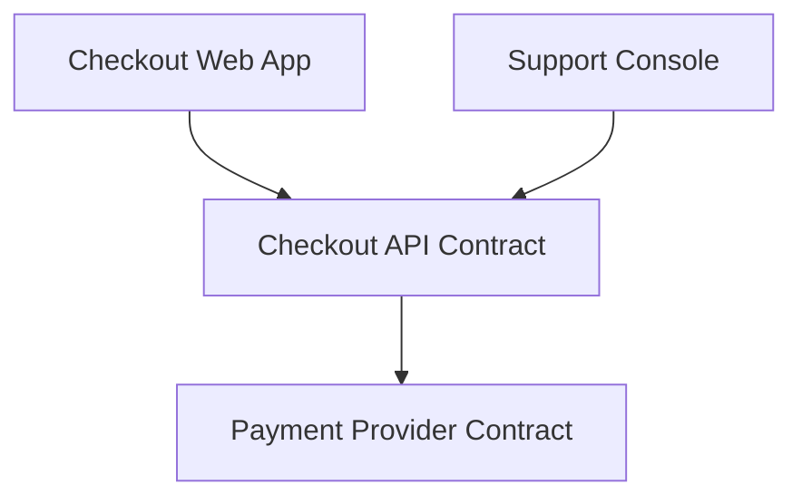
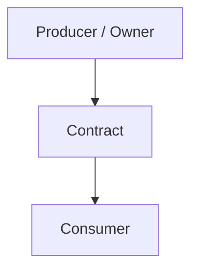

# Template: `contract-view`

> Reusable template for a `design-artifact` with `artifact_subtype: contract-view`.

**Status**: Draft framework template.
**Purpose**: Standardize how AI-in-SDLC represents source-of-truth interfaces such as APIs, events, schemas, CLI surfaces, and other externally consumed contracts.

---

## When to use this template

Use a `contract-view` when the active scope needs to answer:

- What interface is the source of truth between two or more parties?
- Who produces the contract and who consumes it?
- What fields, operations, events, or commands matter?
- What compatibility, versioning, or migration constraints apply?

Typical triggers:

- API or event schema changes
- review of cross-service or external-facing changes
- requirement changes that alter request/response or schema behavior
- brownfield recovery when interface ownership is unclear
- release readiness for contract-sensitive systems

---

## Scope compatibility

Recommended `scope_type` values:

- `service`
- `system`
- `flow`

Avoid using `contract-view` for:

- static system boundary mapping only → use `context-view`
- runtime step ordering → use `interaction-view`
- deployment or infrastructure placement → use `deployment-view`
- internal component decomposition → use `component-view`

---

## Required metadata

Suggested `attributes.yaml`:

```yaml
artifact_subtype: contract-view
scope_type: service
scope_ref: checkout-api
view_purpose: "Describe the source-of-truth API contract exposed by Checkout API and the compatibility expectations for its consumers."
audience:
  - developer
  - reviewer
  - architect
  - operator
confidence_level: high
validation_status: validated
reconstructed_from:
  - api-spec
  - code
source_artifact_version_ids: []
freshness_expectation: on-change
waiver_state: none
```

Minimum required fields for M1:

- `artifact_subtype`
- `scope_type`
- `scope_ref`
- `view_purpose`
- `confidence_level`
- `validation_status`

---

## Required content sections

Every `contract-view` artifact should include these sections in `content.md`.

### 1. Scope statement

State clearly:

- what contract this view covers,
- who owns it,
- and what is intentionally out of scope.

Example:

> This view covers the Checkout API contract used by the Web App, Support Console, and partner integrations. Internal service-to-service calls behind the Checkout API are out of scope.

### 2. Contract type and source of truth

State the contract type explicitly.

Examples:

- REST API
- GraphQL schema
- Async event schema
- CLI command surface
- file/data schema

Also record the source of truth, such as:

- OpenAPI spec
- AsyncAPI spec
- protobuf file
- JSON Schema
- command spec

### 3. Producers and consumers

List the producer/owner of the contract and the main consumers.

For each one, describe:

- name
- role
- ownership/team note
- internal/external status

### 4. Contract surface summary

Summarize the key operations, events, or schema elements.

Examples:

- endpoints and methods
- event names and payload categories
- commands and flags
- key schema objects or entities

### 5. Compatibility and versioning rules

State the compatibility expectations for consumers.

Examples:

- backward compatibility requirement
- versioning strategy
- deprecation window
- additive vs breaking change rules
- schema evolution constraints

### 6. Validation and enforcement notes

Capture how the contract is verified or enforced.

Examples:

- consumer-driven contract tests
- schema registry validation
- request/response validation middleware
- CLI compatibility tests

### 7. Migration / change notes

If the contract is changing, summarize the migration or transition expectations.

Examples:

- dual-write / dual-read period
- version bump and deprecation path
- consumer notification requirement
- rollout order

### 8. Open questions / assumptions

If the contract-view is reconstructed or incomplete, record the uncertain parts.

Examples:

- one downstream consumer inferred from logs, not confirmed by ownership registry
- backward compatibility promise assumed from convention, not documented in spec

---

## Minimum visual / structural content

Regardless of representation style, a valid `contract-view` should show or describe:

- the contract owner,
- the primary consumers,
- the contract surface,
- and the compatibility expectations.

If the source-of-truth spec already exists, the contract-view should summarize and contextualize it rather than duplicating it blindly.

---

## Supported representation styles

The framework should allow any of the following:

### Option A — Structured Markdown + linked spec

Best when OpenAPI, AsyncAPI, protobuf, or schema files already exist.

### Option B — Mermaid overview diagram

Useful for showing producer/consumer relationships around a contract.



### Option C — Excalidraw

Useful when discussing ownership, deprecation, and migration of complex contracts across teams.

---

## Canonical `content.md` template

```markdown
# Contract View: [Contract Name]

## Scope

- **Scope type**: [service | system | flow]
- **Scope ref**: [stable identifier]
- **Contract owner**: [service / team / system]
- **In scope**: [what contract surface is covered]
- **Out of scope**: [what is excluded]

## Purpose

[One paragraph explaining why this contract-view exists and what interface question it answers.]

## Contract Type and Source of Truth

- **Type**: [REST API / event schema / CLI / file schema / other]
- **Source of truth**: [OpenAPI / AsyncAPI / protobuf / JSON Schema / command spec / other]
- **Canonical location**: [path or URI]

## Producers and Consumers

| Party | Role | Internal / External | Ownership / Notes |
|---|---|---|---|
| [name] | [producer/consumer] | [internal/external] | [notes] |

## Contract Surface Summary

- [endpoint / event / command / schema object]
- [endpoint / event / command / schema object]

## Compatibility and Versioning Rules

- [compatibility rule]
- [versioning/deprecation rule]

## Validation and Enforcement Notes

- [contract test / schema validation / runtime enforcement note]
- [contract test / schema validation / runtime enforcement note]

## Migration / Change Notes

- [migration note]
- [consumer notification / rollout note]

## Representation

### Mermaid / Overview



## Open Questions / Assumptions

- [question or assumption]
- [question or assumption]
```

---

## Review checklist

Before approving a `contract-view`, verify:

- [ ] The contract owner is explicit.
- [ ] The primary consumers are identified.
- [ ] The source of truth is named and linked.
- [ ] The contract surface is summarized clearly enough for review.
- [ ] Compatibility/versioning expectations are explicit.
- [ ] Validation/enforcement mechanisms are described.
- [ ] Migration/deprecation notes exist when the contract is changing.
- [ ] Open assumptions are explicit if the artifact is reconstructed.

---

## Common mistakes to avoid

### 1. Spec dump without context

The artifact pastes a large OpenAPI or schema excerpt but never explains ownership, compatibility, or consumer impact.

Fix: summarize the contract and link the canonical spec instead of duplicating it blindly.

### 2. Interaction-view leakage

The artifact focuses on request ordering over time rather than the interface itself.

Fix: move flow ordering details into `interaction-view`.

### 3. Missing consumer impact

The contract is described as if only the producer matters.

Fix: list the main consumers and compatibility expectations explicitly.

### 4. Undefined compatibility policy

The contract changes, but there is no statement of what counts as breaking, additive, or deprecated.

Fix: add explicit compatibility/versioning rules.

### 5. Unvalidated brownfield certainty

The contract ownership or consumer list is treated as fact even though it was inferred.

Fix: carry confidence and assumptions explicitly.

---

## Relationship to other templates

- Use `context-view` to show where the contract sits in the broader boundary.
- Use `interaction-view` to show how the contract is exercised in a critical flow.
- Use `deployment-view` when contract changes have infrastructure/runtime placement implications.
