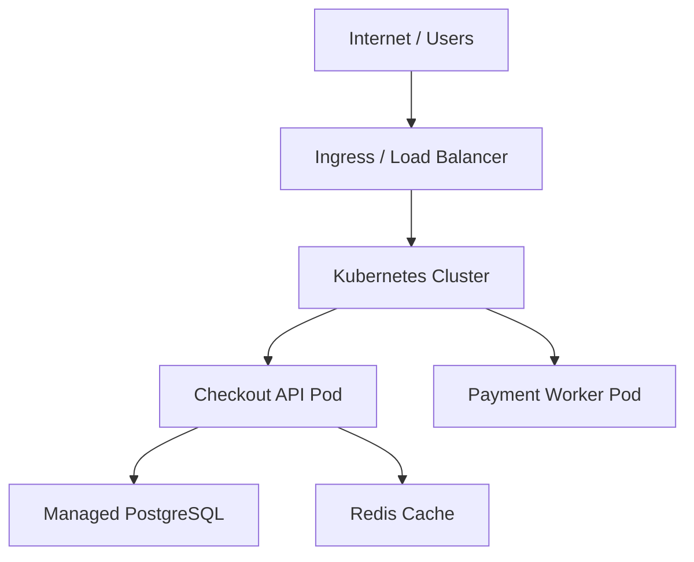
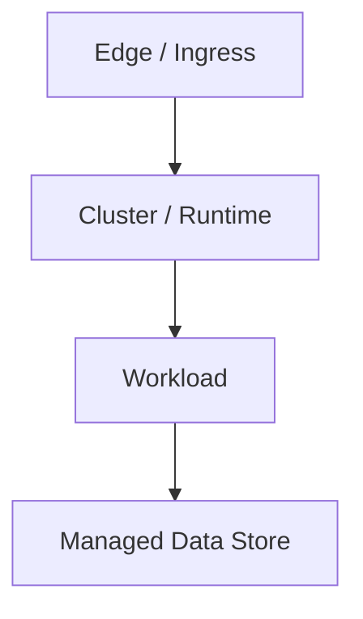

# Template: `deployment-view`

> Reusable template for a `design-artifact` with `artifact_subtype: deployment-view`.

**Status**: Draft framework template.
**Purpose**: Standardize how AI-in-SDLC represents runtime placement, infrastructure topology, trust/network boundaries, and the mapping from logical containers to actual execution environments.

---

## When to use this template

Use a `deployment-view` when the active scope needs to answer:

- Where do the major containers or workloads actually run?
- Which nodes, clusters, environments, or cloud resources matter?
- What network or trust boundaries exist?
- Which runtime placement or infrastructure constraints affect reliability, security, or release readiness?

Typical triggers:

- release readiness for distributed systems
- brownfield recovery where runtime placement is unclear
- debugging or review involving infrastructure/network boundaries
- platform or IaC change analysis
- multi-environment rollout, migration, or incident-response planning

---

## Scope compatibility

Recommended `scope_type` values:

- `service`
- `subsystem`
- `system`

Avoid using `deployment-view` for:

- pure system boundary mapping → use `context-view`
- logical runtime unit inventory without placement → use `container-view`
- request/event ordering over time → use `interaction-view`
- contract ownership and compatibility → use `contract-view`

---

## Required metadata

Suggested `attributes.yaml`:

```yaml
artifact_subtype: deployment-view
scope_type: system
scope_ref: payments-platform
view_purpose: "Show where the major runtime workloads of the payments platform run, including cluster boundaries, data stores, and external network edges."
audience:
  - developer
  - reviewer
  - architect
  - operator
confidence_level: medium
validation_status: partially-validated
reconstructed_from:
  - infra
  - code
  - legacy-doc
source_artifact_version_ids: []
freshness_expectation: on-change
waiver_state: none
```

Minimum required fields for M1:

- `artifact_subtype`
- `scope_type`
- `scope_ref`
- `view_purpose`
- `confidence_level`
- `validation_status`

---

## Required content sections

Every `deployment-view` artifact should include these sections in `content.md`.

### 1. Scope statement

State clearly:

- what runtime/infrastructure slice this view covers,
- which environments are included,
- and what is intentionally excluded.

Example:

> This view covers the production deployment of the Checkout Platform, including Kubernetes workloads, PostgreSQL, Redis, ingress, and external payment-network edges. CI/CD pipelines and local development environments are out of scope.

### 2. Environment and node summary

List the major runtime environments or node groups involved.

Examples:

- production Kubernetes cluster
- staging cluster
- managed PostgreSQL instance
- Redis cache
- object storage bucket
- edge/CDN or ingress layer

For each one, describe:

- name
- type
- role
- environment or region
- ownership notes

### 3. Container-to-runtime mapping

Explain where the logical containers/workloads run.

Examples:

- Checkout API runs as Kubernetes Deployment in `payments-prod`
- Payment Worker runs as a separate worker Deployment
- PostgreSQL is a managed cloud database outside the cluster

### 4. Network and trust boundaries

Describe important boundaries such as:

- public vs private network edges
- cluster boundaries
- VPC/VNet boundaries
- regulated or sensitive data zones
- third-party network edges

### 5. Data and messaging infrastructure

Call out the runtime placement of:

- databases
- caches
- queues/event buses
- object storage
- secrets/config systems

### 6. Operational constraints and resilience notes

Capture high-level operational characteristics such as:

- single-region vs multi-region
- failover or backup expectations
- autoscaling behavior
- stateful workload considerations
- operational choke points or blast-radius concerns

### 7. Open questions / assumptions

If the deployment-view is reconstructed or incomplete, record the uncertain parts.

Examples:

- exact Redis HA topology inferred from Terraform modules, not validated in runtime
- ingress path assumed from Helm values rather than observed traffic

---

## Minimum visual content

Regardless of representation style, a valid `deployment-view` should show:

- the major runtime environments or nodes,
- where key workloads or containers run,
- the important data/messaging infrastructure,
- and the key trust/network boundaries.

If the artifact is text-only, the same information must be expressed in structured Markdown.

---

## Supported representation styles

The framework should allow any of the following:

### Option A — Mermaid infrastructure overview

Best for repo-native, text-first deployment summaries.



### Option B — Excalidraw

Best for collaborative architecture and operations review, especially when discussing network zones, cloud resources, and blast radius.

### Option C — Structured Markdown only

Acceptable for early brownfield recovery or when runtime placement needs to be captured quickly before a polished diagram exists.

---

## Canonical `content.md` template

```markdown
# Deployment View: [System or Runtime Slice Name]

## Scope

- **Scope type**: [service | subsystem | system]
- **Scope ref**: [stable identifier]
- **Environments covered**: [prod / staging / all / specific region]
- **In scope**: [what runtime slice is covered]
- **Out of scope**: [what is excluded]

## Purpose

[One paragraph explaining why this deployment-view exists and what runtime-placement question it answers.]

## Environment and Node Summary

| Runtime Node / Environment | Type | Role | Region / Environment | Notes |
|---|---|---|---|---|
| [name] | [cluster / VM / managed DB / cache / queue / storage] | [role] | [region/env] | [notes] |

## Container-to-Runtime Mapping

- [container/workload] → [runtime node/environment]
- [container/workload] → [runtime node/environment]

## Network and Trust Boundaries

- [boundary note]
- [public/private or trust boundary note]

## Data and Messaging Infrastructure

- [database/cache/queue/storage note]
- [database/cache/queue/storage note]

## Operational Constraints and Resilience Notes

- [failover / scaling / stateful note]
- [blast radius / choke point note]

## Representation

### Mermaid / Diagram



## Open Questions / Assumptions

- [question or assumption]
- [question or assumption]
```

---

## Review checklist

Before approving a `deployment-view`, verify:

- [ ] The runtime slice and environments are clearly named.
- [ ] Major runtime nodes or environments are identified.
- [ ] Key workloads are mapped to where they run.
- [ ] Data and messaging infrastructure placement is identified.
- [ ] Trust/network boundaries are explicit where relevant.
- [ ] Operational constraints or resilience concerns are captured.
- [ ] The view does not drift into pure container inventory without placement.
- [ ] Open assumptions are explicit if the artifact is reconstructed.

---

## Common mistakes to avoid

### 1. Container-view leakage

The artifact lists services and databases but never shows where they run or what boundaries separate them.

Fix: add environment, node, and placement context.

### 2. Missing trust boundaries

The runtime topology is shown, but public/private edges, zones, or third-party boundaries are not visible.

Fix: make network and trust boundaries explicit.

### 3. No environment distinction

The artifact mixes production, staging, and local assumptions into one ambiguous diagram.

Fix: name the environments covered and scope the view intentionally.

### 4. Infrastructure without workload mapping

The cloud resources are shown, but a reviewer still cannot tell which workload runs where.

Fix: add an explicit container/workload-to-runtime mapping section.

### 5. Unvalidated brownfield certainty

The runtime topology is presented as fact even though it was inferred from IaC or config.

Fix: carry confidence and assumptions explicitly.

---

## Relationship to other templates

- Use `container-view` to show the logical runtime units first.
- Use `interaction-view` to show how a critical flow traverses the deployed system.
- Use `contract-view` when infrastructure changes affect source-of-truth interfaces or cross-boundary contracts.
