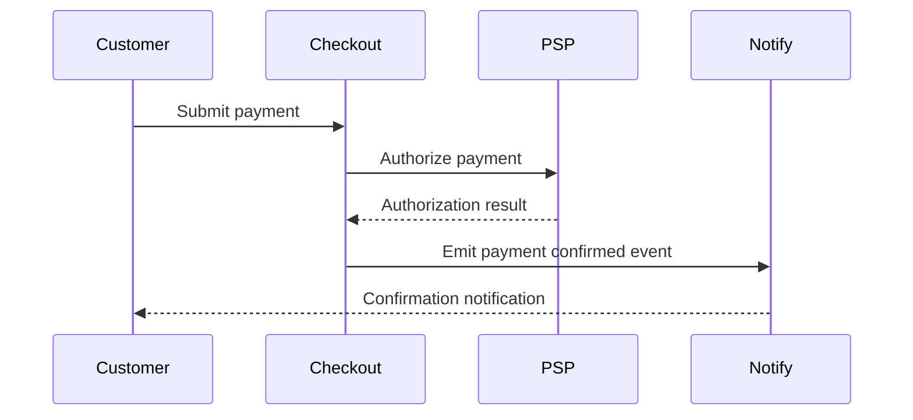
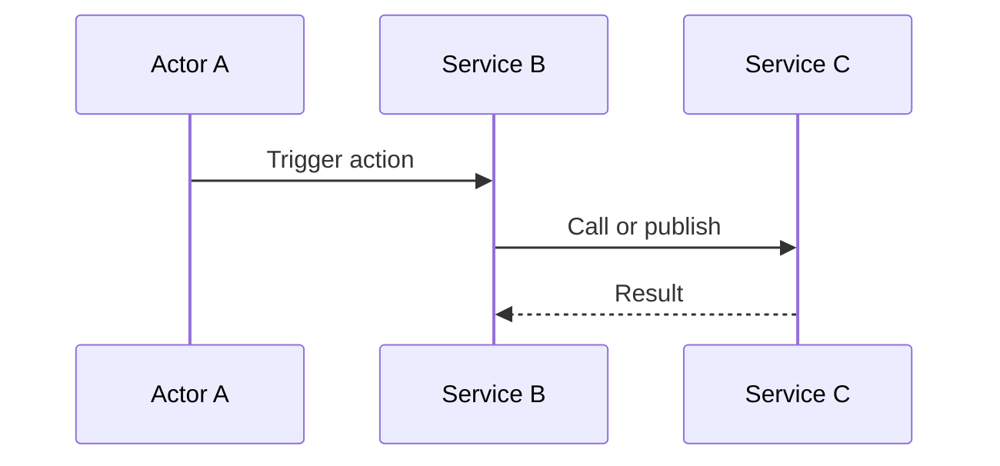

# Template: `interaction-view`

> Reusable template for a `design-artifact` with `artifact_subtype: interaction-view`.

**Status**: Draft framework template.
**Purpose**: Standardize how AI-in-SDLC represents a critical end-to-end flow across systems, containers, services, or actors over time.

---

## When to use this template

Use an `interaction-view` when the active scope needs to answer:

- How does one important user, system, or service flow actually happen step by step?
- Which actors/containers participate in the flow?
- What is the order of requests, events, state changes, or side effects?
- Where can the flow fail, retry, branch, or require approval?

Typical triggers:

- debugging a critical path
- reviewing a risky change that crosses service or component boundaries
- brownfield reconstruction of an important flow
- defining or clarifying acceptance criteria for a scenario
- release readiness for a high-risk flow

---

## Scope compatibility

Recommended `scope_type` values:

- `flow`
- `service`
- `system`

Avoid using `interaction-view` for:

- pure system boundary mapping → use `context-view`
- static inventory of runtime units → use `container-view`
- concurrency/runtime topology across many flows → use `process-view`
- entity lifecycle transitions over time → use `state-view`

---

## Required metadata

Suggested `attributes.yaml`:

```yaml
artifact_subtype: interaction-view
scope_type: flow
scope_ref: checkout-payment-flow
view_purpose: "Show the end-to-end interaction between customer, checkout service, payment provider, and notification components during payment submission."
audience:
  - developer
  - reviewer
  - architect
  - operator
confidence_level: medium
validation_status: partially-validated
reconstructed_from:
  - code
  - trace
  - incident
source_artifact_version_ids: []
freshness_expectation: on-change
waiver_state: none
```

Minimum required fields for M1:

- `artifact_subtype`
- `scope_type`
- `scope_ref`
- `view_purpose`
- `confidence_level`
- `validation_status`

---

## Required content sections

Every `interaction-view` artifact should include these sections in `content.md`.

### 1. Scope statement

State clearly:

- what flow this view describes,
- the entry condition,
- the success outcome,
- and what is intentionally out of scope.

Example:

> This view describes the checkout payment submission flow from the customer clicking “Pay” to payment confirmation and notification dispatch. Refunds, reconciliation, and asynchronous fraud re-review are out of scope.

### 2. Trigger and preconditions

Describe what starts the flow and what must already be true.

Examples:

- user has an active checkout session
- payment method token is already collected
- order is in `pending-payment`

### 3. Participants

List the actors, systems, services, or containers that participate.

For each participant, describe:

- name
- role in the flow
- whether it is internal or external

### 4. Main success path

Describe the canonical happy path step by step.

For each step, include:

- initiator
- receiver
- action
- important data/contract
- resulting state or side effect

### 5. Failure / branch paths

List the important alternative paths.

Examples:

- timeout from payment provider
- fraud review branch
- retry path
- compensation/rollback path
- approval/manual review path

### 6. State and side-effect notes

Summarize notable state changes or side effects caused during the interaction.

Examples:

- order status transition
- event emission
- database write
- notification dispatch

### 7. Contracts and timing notes

Capture the contracts or expectations that shape the flow.

Examples:

- endpoint or event schema involved
- idempotency requirement
- correlation ID propagation
- SLA/timeout expectation

### 8. Open questions / assumptions

If the interaction-view is reconstructed or incomplete, record the uncertain parts.

Examples:

- retry path inferred from logs, not confirmed in code
- fraud service callback ordering assumed from incident trace

---

## Minimum visual content

Regardless of representation style, a valid `interaction-view` should show:

- the participating actors/systems/containers,
- the ordering of the main interactions,
- the key branch or failure points,
- and enough labels to understand what each step does.

If the artifact is text-only, the same information must be expressed in structured Markdown.

---

## Supported representation styles

The framework should allow any of the following:

### Option A — Mermaid sequence or flowchart

Best for repo-native, text-first flow descriptions.



### Option B — Excalidraw

Best for collaborative review of one critical flow, especially when discussing branch paths and annotations.

### Option C — Structured Markdown only

Acceptable for early brownfield recovery or requirement clarification when the ordering matters more than polished visuals.

---

## Canonical `content.md` template

```markdown
# Interaction View: [Flow Name]

## Scope

- **Scope type**: [flow | service | system]
- **Scope ref**: [stable identifier]
- **Entry condition**: [what starts the flow]
- **Success outcome**: [what counts as successful completion]
- **Out of scope**: [what this view does not cover]

## Purpose

[One paragraph explaining why this interaction-view exists and what architectural question it answers.]

## Trigger and Preconditions

- [precondition]
- [precondition]

## Participants

| Participant | Role | Internal / External | Notes |
|---|---|---|---|
| [name] | [role] | [internal/external] | [notes] |

## Main Success Path

| Step | From | To | Action | Data / Contract | Result |
|---|---|---|---|---|---|
| 1 | [participant] | [participant] | [action] | [schema / endpoint / event] | [state or side effect] |

## Failure / Branch Paths

- [branch or failure path]
- [branch or failure path]

## State and Side-Effect Notes

- [state change or side effect]
- [state change or side effect]

## Contracts and Timing Notes

- [contract or schema note]
- [timeout / SLA / retry / idempotency note]

## Representation

### Mermaid / Diagram



## Open Questions / Assumptions

- [question or assumption]
- [question or assumption]
```

---

## Review checklist

Before approving an `interaction-view`, verify:

- [ ] The flow and its scope are clearly named.
- [ ] Entry condition and success outcome are explicit.
- [ ] Participants are listed.
- [ ] The main success path is described in order.
- [ ] Important branch or failure paths are captured.
- [ ] Relevant contracts, timing, or idempotency notes are included.
- [ ] The view does not drift into pure state-machine or deployment topology territory.
- [ ] Open assumptions are explicit if the artifact is reconstructed.

---

## Common mistakes to avoid

### 1. Container-view leakage

The artifact only lists services or apps and their static relationships, without showing the actual ordered flow.

Fix: show the sequence/ordering of interactions, not just topology.

### 2. State-view leakage

The artifact mostly describes lifecycle transitions of one entity rather than the interaction between participants.

Fix: move lifecycle-focused content into `state-view`.

### 3. Missing branch paths

The happy path is documented, but the risky or important failure path is omitted.

Fix: include at least the most important branch/failure cases relevant to the active scope.

### 4. Unlabeled steps

The arrows exist, but the reader cannot tell what is being requested, published, or changed.

Fix: label actions and identify important contracts or side effects.

### 5. Unvalidated brownfield certainty

The flow is presented as authoritative even though ordering or side effects were inferred.

Fix: carry confidence and assumptions explicitly.

---

## Relationship to other templates

- Use `context-view` to establish the outer system boundary.
- Use `container-view` to show the main static runtime units involved.
- Use `state-view` when lifecycle transitions are the primary question.
- Use `deployment-view` when infrastructure placement or runtime topology matters more than ordered interactions.
