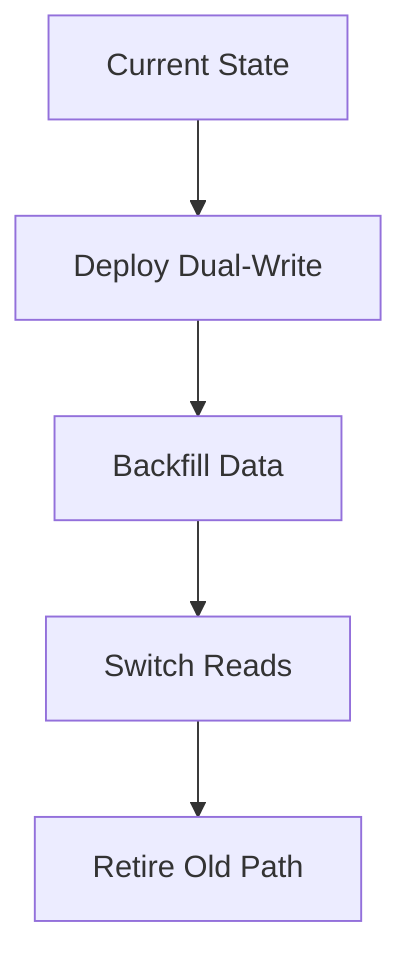
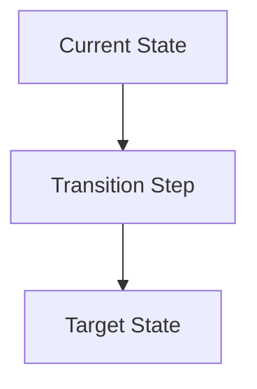

# Template: `migration-view`

> Reusable template for a `design-artifact` with `artifact_subtype: migration-view`.

**Status**: Draft framework template.
**Purpose**: Standardize how AI-in-SDLC represents a transition from an old state to a new state when data, interfaces, runtime placement, or rollout sequencing must change safely.

---

## When to use this template

Use a `migration-view` when the active scope needs to answer:

- What is changing between the current and target state?
- What rollout or transition steps are required?
- What sequencing, compatibility, or rollback constraints exist?
- Which systems, data stores, or consumers are affected during the transition?

Typical triggers:

- stateful resource replacement
- contract version migration
- environment promotion or cutover
- data schema or storage transition
- brownfield modernization of a legacy component

---

## Scope compatibility

Recommended `scope_type` values:

- `release-slice`
- `subsystem`

Avoid using `migration-view` for:

- stable current-state topology only → use `deployment-view`
- request/event ordering inside one steady-state flow → use `interaction-view`
- interface/source-of-truth definition only → use `contract-view`

---

## Required metadata

Suggested `attributes.yaml`:

```yaml
artifact_subtype: migration-view
scope_type: release-slice
scope_ref: checkout-db-cutover
view_purpose: "Describe the transition from the current checkout database topology to the new topology, including rollout sequencing and rollback constraints."
audience:
  - developer
  - reviewer
  - architect
  - operator
confidence_level: medium
validation_status: partially-validated
reconstructed_from:
  - infra
  - code
  - ticket
source_artifact_version_ids: []
freshness_expectation: per-release
waiver_state: none
```

Minimum required fields for M1:

- `artifact_subtype`
- `scope_type`
- `scope_ref`
- `view_purpose`
- `confidence_level`
- `validation_status`

---

## Required content sections

Every `migration-view` artifact should include these sections in `content.md`.

### 1. Scope statement

State clearly:

- what is migrating,
- the current state,
- the target state,
- and what is out of scope.

### 2. Drivers and constraints

State why the migration exists and what constraints shape it.

Examples:

- zero-downtime requirement
- backward compatibility window
- data consistency requirement
- environment promotion requirement

### 3. Current state vs target state

Summarize the relevant before/after shape.

### 4. Migration sequence

List the migration steps in order.

For each step, capture:

- action
- owner
- precondition
- success signal

### 5. Compatibility and rollback notes

Describe:

- dual-read / dual-write needs
- canary or phased rollout
- rollback criteria
- irreversible points

### 6. Risks and open questions

Call out transition-specific risks and uncertainties.

---

## Supported representation styles

### Option A — Structured Markdown + ordered steps

Best for explicit rollout and rollback logic.

### Option B — Mermaid flowchart

Best for visualizing migration sequencing.



### Option C — Excalidraw

Best for collaborative migration planning and change review.

---

## Canonical `content.md` template

```markdown
# Migration View: [Migration Name]

## Scope

- **Scope type**: [release-slice | subsystem]
- **Scope ref**: [stable identifier]
- **Current state**: [summary]
- **Target state**: [summary]
- **Out of scope**: [excluded items]

## Purpose

[One paragraph explaining why this migration exists and what transition question it answers.]

## Drivers and Constraints

- [constraint]
- [constraint]

## Current State vs Target State

- **Current**: [summary]
- **Target**: [summary]

## Migration Sequence

| Step | Action | Owner | Precondition | Success Signal |
|---|---|---|---|---|
| 1 | [action] | [owner] | [precondition] | [signal] |

## Compatibility and Rollback Notes

- [compatibility note]
- [rollback note]

## Representation

### Mermaid / Diagram



## Risks and Open Questions

- [risk or question]
- [risk or question]
```

---

## Review checklist

- [ ] Current and target states are explicit.
- [ ] Sequence is ordered and understandable.
- [ ] Compatibility rules are explicit.
- [ ] Rollback path is stated.
- [ ] Irreversible or high-risk points are visible.
- [ ] Open assumptions are explicit if reconstructed.

---

## Common mistakes to avoid

### 1. Target-state only thinking

The document describes the desired future but not how to get there safely.

### 2. No rollback criteria

The plan lists steps but not when or how to stop or reverse.

### 3. Missing compatibility window

Consumers or data paths are forced to change instantly with no transition story.

---

## Relationship to other templates

- Use `contract-view` when interfaces are changing.
- Use `deployment-view` when rollout depends on runtime placement.
- Use `runbook-view` when operators need step-by-step recovery or rollback procedure.
