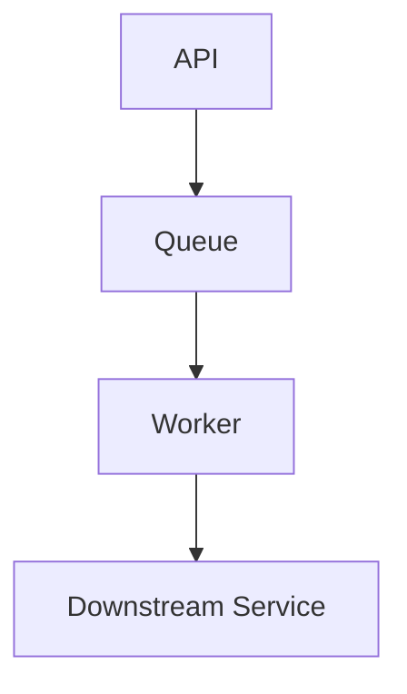
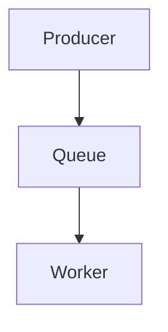

# Template: `process-view`

> Reusable template for a `design-artifact` with `artifact_subtype: process-view`.

**Status**: Draft framework template.
**Purpose**: Standardize how AI-in-SDLC represents runtime concurrency, async boundaries, background processing, queues, and failure isolation behavior across one or more flows.

---

## When to use this template

Use a `process-view` when the active scope needs to answer:

- What runtime processes or asynchronous boundaries matter?
- Where do queues, workers, retries, or isolation boundaries exist?
- How do concurrent/background paths affect correctness or operability?

Typical triggers:

- microservice or event-driven systems
- queue/worker architecture recovery
- debugging concurrency or async behavior
- operational review of failure isolation or retry paths

---

## Scope compatibility

Recommended `scope_type` values:

- `service`
- `subsystem`
- `system`

Avoid using `process-view` for:

- one ordered request/response flow → use `interaction-view`
- lifecycle transitions of one entity → use `state-view`
- infrastructure placement → use `deployment-view`

---

## Required metadata

Suggested `attributes.yaml`:

```yaml
artifact_subtype: process-view
scope_type: subsystem
scope_ref: notification-pipeline
view_purpose: "Show the async runtime boundaries, queue topology, and failure isolation behavior of the notification pipeline."
audience:
  - developer
  - reviewer
  - architect
  - operator
confidence_level: medium
validation_status: partially-validated
reconstructed_from:
  - code
  - infra
  - trace
source_artifact_version_ids: []
freshness_expectation: on-change
waiver_state: none
```

---

## Required content sections

Every `process-view` artifact should include these sections in `content.md`.

### 1. Scope statement

State which runtime process landscape is covered.

### 2. Process / worker catalog

List the major processes, workers, queues, schedulers, or async boundaries.

### 3. Concurrency and isolation notes

Describe what can run concurrently, what is serialized, and where failures are isolated.

### 4. Retry / timeout / queue behavior

Capture behavior that shapes runtime reliability.

### 5. Observability / recovery notes

Describe how operators or developers can observe and reason about the process landscape.

### 6. Open questions / assumptions

Record uncertainty if reconstructed.

---

## Supported representation styles

### Option A — Mermaid flowchart



### Option B — Structured Markdown

Best when queue/worker behavior matters more than polished visuals.

### Option C — Excalidraw

Best for annotated runtime/process reviews.

---

## Canonical `content.md` template

```markdown
# Process View: [Runtime Process Landscape Name]

## Scope

- **Scope type**: [service | subsystem | system]
- **Scope ref**: [stable identifier]
- **Covered runtime/process landscape**: [description]

## Purpose

[One paragraph explaining why this process-view exists and what async/runtime question it answers.]

## Process / Worker Catalog

| Process / Boundary | Type | Responsibility | Notes |
|---|---|---|---|
| [name] | [worker / queue / scheduler / service] | [role] | [notes] |

## Concurrency and Isolation Notes

- [concurrency note]
- [failure isolation note]

## Retry / Timeout / Queue Behavior

- [retry or timeout note]
- [queue or backpressure note]

## Observability / Recovery Notes

- [observability note]
- [recovery note]

## Representation

### Mermaid / Diagram



## Open Questions / Assumptions

- [question or assumption]
```

---

## Review checklist

- [ ] Major async/process boundaries are identified.
- [ ] Concurrency or serialization rules are explicit where relevant.
- [ ] Retry/timeout/queue behavior is described.
- [ ] Failure isolation is visible.
- [ ] Open assumptions are explicit if reconstructed.

---

## Relationship to other templates

- Use `interaction-view` for one critical ordered flow.
- Use `deployment-view` when runtime placement or network boundaries matter more than async logic.
- Use `runbook-view` when operators need step-by-step intervention guidance.
