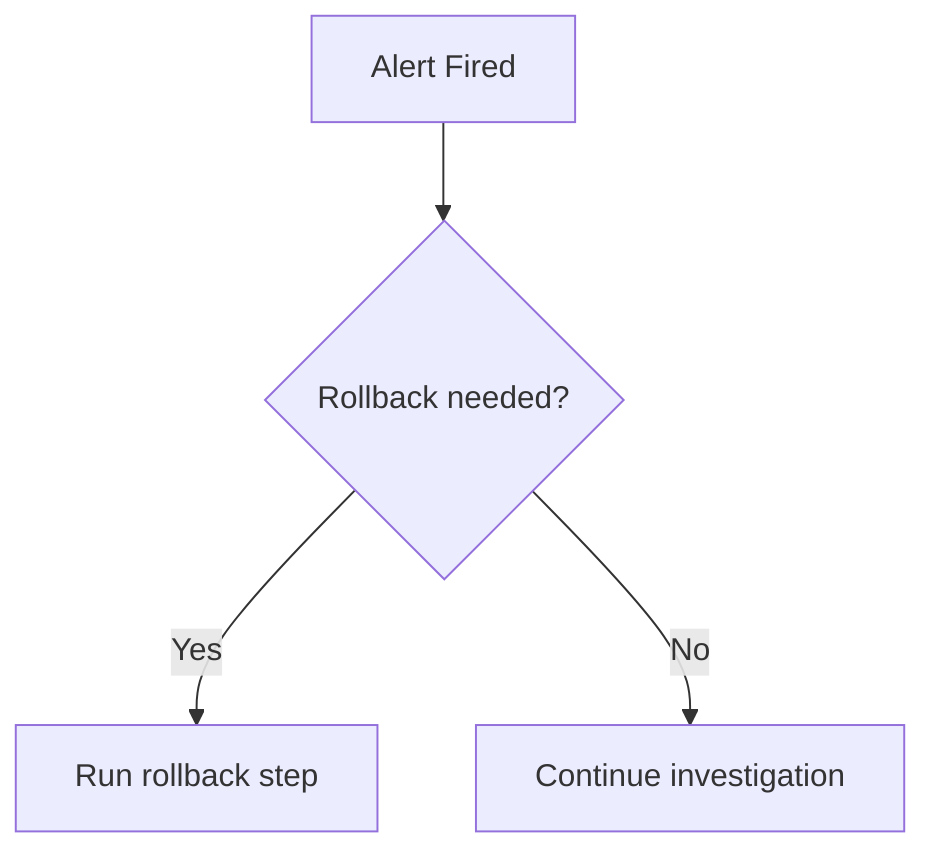
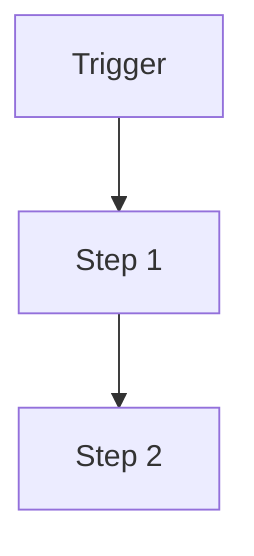

# Template: `runbook-view`

> Reusable template for a `design-artifact` with `artifact_subtype: runbook-view`.

**Status**: Draft framework template.
**Purpose**: Standardize how AI-in-SDLC represents an operator-facing procedure for recovery, rollback, investigation, or safe execution of a sensitive operational workflow.

---

## When to use this template

Use a `runbook-view` when the active scope needs to answer:

- What exact steps should a human or operator follow?
- What are the preconditions, stop conditions, and verification checks?
- How should we recover from or respond to an operational problem?

Typical triggers:

- rollback planning
- incident recovery
- production operational procedure
- brownfield environments with tribal-knowledge-only recovery steps

---

## Scope compatibility

Recommended `scope_type` values:

- `service`
- `workflow`

Avoid using `runbook-view` for:

- steady-state architecture boundaries → use `context-view` / `container-view`
- change-transition planning only → use `migration-view`
- pure runtime placement → use `deployment-view`

---

## Required metadata

Suggested `attributes.yaml`:

```yaml
artifact_subtype: runbook-view
scope_type: workflow
scope_ref: checkout-payment-rollback
view_purpose: "Describe the operator procedure for rollback and verification when checkout payment deployment fails in production."
audience:
  - operator
  - reviewer
  - architect
confidence_level: medium
validation_status: partially-validated
reconstructed_from:
  - incident
  - infra
  - human-interview
source_artifact_version_ids: []
freshness_expectation: incident-driven
waiver_state: none
```

---

## Required content sections

Every `runbook-view` artifact should include these sections in `content.md`.

### 1. Scope statement

State the operational scenario the runbook covers.

### 2. Preconditions

List what must be true before the operator starts.

### 3. Trigger / entry signals

Describe the symptom, alert, or decision that causes the runbook to be used.

### 4. Step-by-step procedure

For each step, capture:

- action
- expected result
- stop condition
- escalation condition

### 5. Verification checks

State how the operator knows the system is healthy again.

### 6. Escalation and ownership notes

Describe who must be paged or who takes over if the runbook fails.

### 7. Open questions / assumptions

Record uncertainty if the runbook was reconstructed from incident memory or partial evidence.

---

## Supported representation styles

### Option A — Structured Markdown

Best for operational procedures.

### Option B — Mermaid flowchart

Best for operator decision trees.



### Option C — Excalidraw

Best for annotated operational workflows used in team reviews.

---

## Canonical `content.md` template

```markdown
# Runbook View: [Runbook Name]

## Scope

- **Scope type**: [service | workflow]
- **Scope ref**: [stable identifier]
- **Scenario**: [what operational situation this covers]

## Purpose

[One paragraph explaining why this runbook exists and what operational question it answers.]

## Preconditions

- [precondition]
- [precondition]

## Trigger / Entry Signals

- [alert, symptom, or decision]

## Procedure

| Step | Action | Expected Result | Stop / Escalate Condition |
|---|---|---|---|
| 1 | [action] | [result] | [condition] |

## Verification Checks

- [health check]
- [health check]

## Escalation and Ownership Notes

- [ownership note]
- [escalation note]

## Representation

### Mermaid / Diagram



## Open Questions / Assumptions

- [question or assumption]
- [question or assumption]
```

---

## Review checklist

- [ ] Trigger condition is explicit.
- [ ] Preconditions are explicit.
- [ ] Procedure is step-by-step and actionable.
- [ ] Verification checks are present.
- [ ] Escalation path is named.
- [ ] Open assumptions are explicit if reconstructed.

---

## Relationship to other templates

- Use `deployment-view` for runtime placement context.
- Use `migration-view` when the runbook is tied to a change transition.
