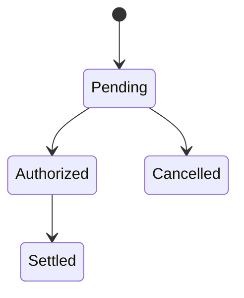

# Template: `state-view`

> Reusable template for a `design-artifact` with `artifact_subtype: state-view`.

**Status**: Draft framework template.
**Purpose**: Standardize how AI-in-SDLC represents the lifecycle of an entity or workflow, including valid states, transitions, guards, and terminal/error conditions.

---

## When to use this template

Use a `state-view` when the active scope needs to answer:

- What states can this entity or workflow be in?
- What transitions are allowed?
- What events or guards control the transitions?
- What failure or terminal states matter?

Typical triggers:

- lifecycle-heavy business workflows
- debugging invalid state transitions
- requirement or review work where state rules are central
- embedded or workflow-driven systems

---

## Scope compatibility

Recommended `scope_type` values:

- `entity`
- `workflow`
- `service`

Avoid using `state-view` for:

- interaction ordering between many participants → use `interaction-view`
- runtime placement or infrastructure → use `deployment-view`

---

## Required metadata

Suggested `attributes.yaml`:

```yaml
artifact_subtype: state-view
scope_type: workflow
scope_ref: order-lifecycle
view_purpose: "Describe the valid lifecycle states and transitions of an order from creation through fulfillment or cancellation."
audience:
  - developer
  - reviewer
  - architect
confidence_level: medium
validation_status: partially-validated
reconstructed_from:
  - code
  - ticket
  - legacy-doc
source_artifact_version_ids: []
freshness_expectation: on-change
waiver_state: none
```

---

## Required content sections

Every `state-view` artifact should include these sections in `content.md`.

### 1. Scope statement

State what entity or workflow lifecycle is covered.

### 2. State catalog

List each state and what it means.

### 3. Transition rules

For each transition, capture:

- from-state
- to-state
- trigger/event
- guard/condition
- side effect if relevant

### 4. Invalid or forbidden transitions

Call out transitions that must never occur.

### 5. Terminal / failure states

Describe final or error states and what they imply.

### 6. Open questions / assumptions

Record uncertainty if the lifecycle was reconstructed.

---

## Supported representation styles

### Option A — Mermaid state diagram



### Option B — Structured Markdown

Best when the lifecycle rules matter more than a polished diagram.

### Option C — Excalidraw

Best for annotated lifecycle review.

---

## Canonical `content.md` template

```markdown
# State View: [Entity or Workflow Name]

## Scope

- **Scope type**: [entity | workflow | service]
- **Scope ref**: [stable identifier]
- **Covered lifecycle**: [description]

## Purpose

[One paragraph explaining why this state-view exists and what lifecycle question it answers.]

## State Catalog

| State | Meaning | Notes |
|---|---|---|
| [state] | [meaning] | [notes] |

## Transition Rules

| From | To | Trigger / Event | Guard | Side Effect |
|---|---|---|---|---|
| [state] | [state] | [trigger] | [guard] | [effect] |

## Invalid / Forbidden Transitions

- [forbidden transition]

## Terminal / Failure States

- [state and meaning]

## Representation

### Mermaid / Diagram


## Open Questions / Assumptions

- [question or assumption]
```

---

## Review checklist

- [ ] State set is complete enough for the active scope.
- [ ] Transition triggers and guards are explicit.
- [ ] Invalid transitions are called out where relevant.
- [ ] Failure/terminal states are represented.
- [ ] Open assumptions are explicit if reconstructed.

---

## Relationship to other templates

- Use `interaction-view` for ordered interactions between participants.
- Use `process-view` for broader concurrency/runtime behavior across many flows.
